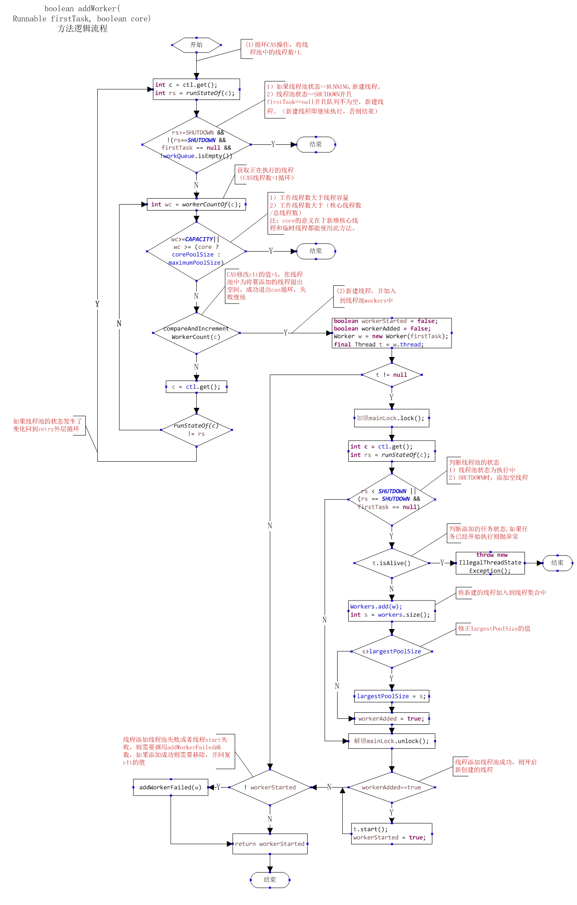

# java8
    partitioningBy分隔/groupingBy分组
    maxBy取最大/minBy取最小
    averagingInt /averagingLong/averagingDouble取平均值
    collectingAndThen 此方法是在进行归纳动作结束之后，对归纳的结果进行二次处理。
    reduce 操作可以实现从Stream中生成一个值，其生成的值不是随意的，而是根据指定的计算模型。比如，之前提到count、min和max方法，因为常用而被纳入标准库中。事实上，这些方法都是reduce操作。

    CompletableFuture ：实现异步编程
    supplyAsync：有返回值
    whenComplete：是执行当前任务的线程执行继续执行 whenComplete 的任务。
    whenCompleteAsync：是执行把 whenCompleteAsync 这个任务继续提交给线程池来进行执行。
    thenCompose：将在与上游任务相同的线程上调用generateRequest()(如果上游任务已经完成，则调用该线程).
    thenComposeAsync：将在提供的执行程序(如果提供)上调用generateRequest()，否则将在默认的ForkJoinPool上调用.

    1、new Thread的弊端
        a. 每次new Thread新建对象性能差。
        b. 线程缺乏统一管理，可能无限制新建线程，相互之间竞争，及可能占用过多系统资源导致死机或oom。
        c. 缺乏更多功能，如定时执行、定期执行、线程中断。
    相比new Thread，Java提供的四种线程池的好处在于：
        a. 重用存在的线程，减少对象创建、消亡的开销，性能佳。
        b. 可有效控制最大并发线程数，提高系统资源的使用率，同时避免过多资源竞争，避免堵塞。
        c. 提供定时执行、定期执行、单线程、并发数控制等功能。
    2、Java 线程池
        Java通过Executors提供四种线程池，分别为：
            newCachedThreadPool创建一个可缓存线程池，如果线程池长度超过处理需要，可灵活回收空闲线程，若无可回收，则新建线程。
            newFixedThreadPool 创建一个定长线程池，可控制线程最大并发数，超出的线程会在队列中等待。
            newScheduledThreadPool 创建一个定长线程池，支持定时及周期性任务执行。
            newSingleThreadExecutor 创建一个单线程化的线程池，它只会用唯一的工作线程来执行任务，保证所有任务按照指定顺序(FIFO, LIFO, 优先级)执行。
        如果线程池中线程的数量过多，最终它们会竞争稀缺的处理器和内存资源，浪费大量的时间在上下文切换上。反之，如果线程的数目过少，正如你的应用所面临的情况，处理器的一些核可能就无法充分利用。
        N threads = N CPU * U CPU * (1 + W/C)
            N CPU是处理器的核的数目，可以通过Runtime.getRuntime().availableProcessors()得到
            U CPU是期望的CPU利用率（该值应该介于0和1之间）
            W/C是等待时间与计算时间的比率
    对集合进行并行计算有两种方式：
        要么将其转化为并行流，利用map这样的操作开展工作，
        要么枚举出集合中的每一个元素，创建新的线程，在CompletableFuture内对其进行操作。
    并行——使用流还是CompletableFutures？
        如果你进行的是计算密集型的操作，并且没有I/O，那么推荐使用Stream接口，因为实现简单，同时效率也可能是最高的（如果所有的线程都是计算密集型的，那就没有必要创建比处理器核数更多的线程）。
        反之，如果你并行的工作单元还涉及等待I/O的操作（包括网络连接等待），那么使用CompletableFuture灵活性更好，你可以像前文讨论的那样，依据等待/计算，或者W/C的比率设定需要使用的线程数。这种情况不使用并行流的另一个原因是，处理流的流水线中如果发生I/O等待，流的延迟特性会让我们很难判断到底什么时候触发了等待。
    Java 8的 CompletableFuture API提供了名为thenCompose的方法，它就是专门为这一目的而设计的，thenCompose方法允许你对两个异步操作进行流水线，第一个操作完成时，将其结果作为参数传递给第二个操作。

# java并发编程之美
## 第1章 并发编程线程基础
    线程是进程中的一个实体，线程本身是不会独立存在的。
    进程是代码在数据集合上的一次运行活动，是系统进行资源分配和调度的基本单位，线程则是进程的一个执行路径，一个进程中至少有一个线程，进程中的多个线程共享进程的资源。
    操作系统在分配资源时是把资源分配给进程的，但是CPU资源比较特殊，它是被分配到线程的，因为真正要占用CPU运行的是线程，所以也说线程是CPU分配的基本单位。
    进程：是系统进行资源分配和调度的基本单位
        一个进程中有多个线程，多个线程共享进程的堆和方法区资源，但是每个线程有自己的程序计数器和栈区域。
    线程：是CPU分配的基本单位
        程序计数器是一块内存区域，用来记录线程当前要执行的指令地址。
    sleep与yield方法的区别在于：
        当线程调用sleep方法时调用线程会被阻塞挂起指定的时间，在这期间线程调度器不会去调度该线程。
        而调用yield方法时，线程只是让出自己剩余的时间片，并没有被阻塞挂起，而是处于就绪状态，线程调度器下一次调度时就有可能调度到当前线程执行。
    线程上下文切换时机有：当前线程的 CPU 时间片使用完处于就绪状态时，当前线程被其他线程中断时。
    线程通常都有五种状态：创建、就绪、运行、阻塞和死亡。
        第一是创建状态。在生成线程对象，并没有调用该对象的start方法，这是线程处于创建状态。
        第二是就绪状态。当调用了线程对象的start方法之后，该线程就进入了就绪状态，但是此时线程调度程序还没有把该线程设置为当前线程，此时处于就绪状态。在线程运行之后，从等待或者睡眠中回来之后，也会处于就绪状态。
        第三是运行状态。线程调度程序将处于就绪状态的线程设置为当前线程，此时线程就进入了运行状态，开始运行run函数当中的代码。
        第四是阻塞状态。线程正在运行的时候，被暂停，通常是为了等待某个时间的发生(比如说某项资源就绪)之后再继续运行。sleep,suspend，wait等方法都可以导致线程阻塞。
        第五是死亡状态。如果一个线程的run方法执行结束或者调用stop方法后，该线程就会死亡。对于已经死亡的线程，无法再使用start方法令其进入就绪。
    子线程中，主线程中断，会抛出 InterruptedException 异常，子线程会继续运行，需要子线程中断（thread.interrupt();）
    主线程中，子线程中断，子线程会抛出 InterruptedException 异常。
## 第2章 并发编程的其他基础知识
    并发和并行的概念
        并发：指同一个时间段内多个任务同时都在执行，并且都没有执行结束
        并行：在单位时间内多个任务同时执行
    共享资源：资源被多个线程所持有或者多个线程都可以去访问该资源。
    线程操作共享变量时，首先从主内存复制共享变量到自己的工作内存，然后对工作内存里的变量仅从处理，处理完后将变量值更新到主内存。    
    synchronized 块时java提供的一种原子性内置锁，也叫做监视器锁。是排他锁，其他线程必须等待该线程释放锁后才能获取该锁。
        当获取锁后会清空锁块内本地内存中将会被用到的共享变量，在使用这些共享变量时从主内存进行加载，在释放锁时将本地内存中修改的共享变量刷新到主内存。
        实现了原子性操作
        锁升级：偏向锁，自旋锁（默认自选10次），重量级锁
    volatile（保证了可见性和有序性）
        当一个变量被声明为volatile时，线程再写入变量时不会把值缓存在寄存器或者其他地方，而是会把值刷新会主内存。其他线程读取该共享变量时，会从主内存重新获取最新值。
        禁止进行指令重排序。（实现有序性）
        只能保证对单次读/写的原子性。i++ 这种操作不能保证原子性。
        虽然提供了可见性保证，但并不保证操作的原子性。
    CAS 
        ABA问题：JDK中的AtomicStampedReference类给每个变量的状态值都配备了一个时间戳，从而避免了ABA问题的产生
    指令重排序
        java内存模型允许编译器和处理器对指令重排序以提高运行性能，并且只会对不存在数据依赖型的指令重排序。（不影响最终结果的，就可能被重排序）
    伪共享
        在Cache内部是按行存储的，其中每一行成为Cache行。Cache行是Cache与主内存进行数据交换的单位，Cache行的大小一般为2的幂次数字节。
        多个线程同时修改一个缓存行里面的多个变量时，由于同时只能有一个线程操作缓存行，所以相比将每个变量放到一个缓存行，性能会有所下降，这就是伪共享。
        CPU访问变量，不在Cache的话，会把该变量所在内存区域的一个Cache行大小的内存复制到Cache中。
    锁的概念
        悲观锁
            是指对数据的修改持保守态度，认为数据很容易就会被其他线程修改，所以在数据被处理（读和写）前先对数据进行加锁。
        乐观锁
             则认为数据在一般情况下不会造成冲突，所以在访问数据前不会加锁，而是在修改数据时对数据进行检查（通常是数据的版本，一般是version字段）而进一步决定后续步骤。如果数据没有冲突，则正常修改；如果数据版本产生了冲突，可以什么都不做，也可以重试。
        公平锁
            是指多个线程按照申请锁的顺序来获取锁。（先确认是否有等待线程，如果后，则到等待序列排队）
        非公平锁
            是指多个线程获取锁的顺序并不是按照申请锁的顺序，有可能后申请的线程比先申请的线程优先获取锁。有可能，会造成优先级反转或者饥饿现象。（一来就抢锁资源）
        独占锁（悲观锁）
            同一时间只有一个线程能到的该锁。如：ReentrantLock
        共享锁（乐观锁）
            可以同时由多个线程持有。如：ReadWriteLock 读写锁，它允许一个资源可以被多个线程同时进行读操作。
        可重入锁
            当一个线程已经获取一个对象的锁时，如果在释放该锁之前可以再次获取该对象的锁，那么则为可重入锁 。
        自旋锁
            是当前线程在获取锁时，如果发现锁已经被其他线程占有，它不会马上阻塞自己，在不放弃 CPU 使用权的情况下，多次尝试获取（默认是 10 次），很有可能在后面几次的尝试中其他线程已经释放了该锁。如果尝试指定次数以后仍然没有获取到锁才会阻塞。
        分段锁
            分段锁其实是一种锁的设计，并不是具体的一种锁，对于ConcurrentHashMap而言，其并发的实现就是通过分段锁的形式来实现高效的并发操作。
## 第3章 Java并发包中ThreadLocalRandom类原理剖析
    Random
        是线程安全的，如果要在线程环境中的话就有可能产生性能瓶颈。
        nextInt()方法调用了next(int bits)，next(int bits)内部使用了AtomicLong，并调用了它的compareAndSet方法来保证线程安全性。所以这个是一个线程安全的方法。
        使用CAS操作。当多个线程获取到相同的种子，在 while (!seed.compareAndSet(oldseed, nextseed)); 的时候可以保证只有一个线程更新老的种子为新的，其他线程会继续循环去重新获取种子，这样就保证随机数的随机性。
        但是，有使用CAS操作，会导致多个线程的进行自旋重试，这就会降低并发性能，所以ThreadLocalRandom应运而生。
    ThreadLocalRandom
        可以看出ThreadLocalRandom类继承了Random，并重写了nextint方法，在ThreadlocalRandom没有继承自Random的原子种子变量，在ThreadLocalRandom并没有具体的种子，具体的种子存放到具体调用线程的threadlocalrandomSeed变量里面，就和ThreadLocal一样就是一个工具类，当线程调用ThreadlocalRandom的current，ThreadLocalRandom负责初始化threalocalrandomseed变量，就是初始化种子
        当调用ThreadLocalRandom的nextInt的时候，实际上就是获取当前线程的threadlcoalrandomseed变量作为种子来计算新的种子，然后更新threadlocalrandomseed变量，根据新的种子使用具体的算法计算随机数，需要注意的是，threadlocalrandomseed仅仅是一个普通的long类型变量，并不是原子类型，但是由于他是线程级别的，所以他就不会存在线程安全的问题，并需要原子性变量，
        其中seed和probeGenerator是原子变量，他是在初始化种子的时候使用，每个线程只会调用一次，另外变量instance是ThreadLocalRandom的一个实例，该变量是static,多个线程使用的实例是同一个，但是由于具体的种子存在在线程里面的，所以在ThreadlocalRandom的实例里面只包含线程无关的的通用算法，因此他是线程安全的。
        if (UNSAFE.getInt(Thread.currentThread(), PROBE) == 0)：如上面代码(7)，如果线程的threadlocalRandomProbe的变量值为0时(默认他的值就是0)，则说明他是第一次调用current，那么就会使用localinit()方法计算当前线程的初始化种子，这里是为了延迟初始化，在不使用生成随机数功能时，就不会初始化线程的种子变量，这也是一种优化，
        localInit();：代码(8)首先根据probeGenerator计算当前线程中ThreadLocalRandomProbe的初始值，然后根据seeder计算当前线程的初始化种子，而后把这两个变量放到当前线程，代码9返回ThreadLocalRandom的实例，需要注意的是这个方法是静态方法，多个线程返回的是同一个实例，
## 第4章 java并发包中原子操作类原理剖析
    JUC 并发包中包含有 Atomiclnteger、AtomicLong和tomicBoolean 等原子性操作类，它们的原理类似，本章讲解 AtomicLong 类。 
    AtomicLong 是原子性递增或者递减类，其内部使用 Unsafe 来实现。
    AtomicLong
        如上代码中的两个线程各自统计自己所持数据中0的个数，每当找到一个0就会调用 AtomicLong 原子性递增方法。
        在没有原子类的情况下， 实现计数器需要使用一定的同步措施， 如使用 synchronized 关键字等，但是这些都是阻塞算法，对性能有一定损耗，
        而本章介绍的这些原子操作使用 CAS 非阻塞算法，性能更好，但是在高并发情况下AtomicLong 还会存在性能问题 JDK 提供了一个在高并发下性能更好的 LongAdder 类
        使用 AtomicLong 时，在高并发下大量线程会同时去竞争更新同一个原子变量，但是由于同时只有一个线程的 CAS 操作会成功，这就造成了大量线程竞争失败后，会通过无限循环不断进行自旋尝试 CAS 操作， 这会白白浪费 CPU 资源。
    LongAdder
        (1) LongAdder 的结构是怎样的？ 
        (2) 当前线程应该访问 Cell 数组里面的哪一个 Cell 元素？ 
        (3) 如何初始化 Cell 数组？ 
        (4) Cell 数组如何扩容？ 
        (5) 线程访问分配的 Cell 元素有冲突后如何处理？ 
        (6) 如何保证线程操作被分配的 Cell 元素的原子性？
            @sun.misc.Contended 用于解决伪共享（false sharing）问题
            cas(long cmp, long val)方法，做的事情也就是简单的CAS操作
        LongAdder 会将这个原子变量分离成一个 Cell 数组，每个线程通过 Hash 获取到自己数组，这样就减少了乐观锁的重试次数，从而在高竞争下获得优势；
        而在低竞争下表现的又不是很好，可能是因为自己本身机制的执行时间大于了锁竞争的自旋时间，因此在低竞争下表现性能不如 AtomicInteger。
        在低竞争的并发环境下 AtomicInteger 的性能是要比 LongAdder 的性能好，而高竞争环境下 LongAdder 的性能比 AtomicInteger 好，因此我们在使用时要结合自身的业务情况来选择相应的类型。
    LongAccumulator 类原理探究
        分段进行CAS重试，最后结果再累加，提升了程序的并行性能 
## 第5章 Java并发包中并发List源码剖析
    CopyOnWriteArrayList
        并发包中的并发List只有CopyOnWriteArrayList。
        CopyOnWriteArrayList使用写时复制的策略，来保证list的一致性，而获取-修改-写入，这三步操作不是原子性的，所以，在增删改的过程中都使用了独占锁，来保证在某个时刻，只有一个线程能对list进行操作，是线程安全的，但是写时复制会导致弱一致性问题。
        另外，CopyOnWriteArrayList 提供了弱一致性的迭代器，从而保证在获取迭代器后，其他线程对 list 的修改是不可见的，迭代器遍历的数组是一个快照。
        而且，CopyOnWriteArraySet 的底层是 使用 CopyOnWriteArrayList 实现的。
## 第6章 Java并发包中锁原理剖析
    LockSupport工具类
        JDK 中的 rt.jar 包里面的 LockSupport 是个工具类，它的主要作用是挂起和唤醒线程，该工具类是创建锁和其他同步类的基础。
        LockSupport类的核心方法其实就两个：park()和unpark()，其中park()方法用来阻塞当前调用线程，unpark()方法用于唤醒指定线程。
        park/unpark 与 wait/notify的区别：
            （1）wait和notify都是Object中的方法,在调用这两个方法前必须先获得锁对象，但是park不需要获取某个对象的锁就可以锁住线程。
            （2）notify只能随机选择一个线程唤醒，无法唤醒指定的线程，unpark却可以唤醒一个指定的线程。
            （3）unpark函数可以先于park调用，所以不需要担心线程间的执行的先后顺序。
        LockSupport.park()会检查线程是否设置了中断标志位，如果设置了，则返回（这里并不会清除中断标志位）
        Thread.interrupted()会清除中断标志
        sleep清除中断标志位但不会更改_counter
        方法介绍
            park()： 阻塞当前线程，直到unpark方法被调用或当前线程被中断，park方法才会返回。
            park(Object blocker)： 同park()方法，多了一个阻塞对象blocker参数。
            parkNanos(long nanos)： 同park方法，nanos表示最长阻塞超时时间，超时后park方法将自动返回。
            parkNanos(Object blocker, long nanos)： 同parkNanos(long nanos)方法，多了一个阻塞对象blocker参数。
            parkUntil(long deadline)： 同park()方法，deadline参数表示最长阻塞到某一个时间点，当到达这个时间点，park方法将自动返回。（该时间为从1970年到现在某一个时间点的毫秒数）
            parkUntil(Object blocker, long deadline)： 同parkUntil(long deadline)方法，多了一个阻塞对象blocker参数。
            unpark(Thread thread)： 唤醒处于阻塞状态的线程thread。
    抽象同步队列AQS概述
        AbstractQueuedSynchronizer抽象同步队列简称AQS，它是实现同步器的基础组件，并发包中锁的底层就是使用AQS实现的。
        AQS是一个FIFO的双向队列,内部通过节点head和tail记录队首和队尾元素，队列元素类型为Node，其中Node中的thread变量用来存放进入AQS队列里面的线程; prev记录当前节点的前驱节点,next记录当前节点的后继节点。
        AQS采用模板方法模式，父类抽象出通用模板，将方法延迟到子类加载。
        $Node节点:
            SHARED: 标记该线程是获取共享资源时被阻塞挂起放入AQS队列的
            EXCLUSIVE: 标记线程是获取独占资源时被挂起后放入AQS队列的
        $waitStatus:记录当前线程等待状态
            CANCELLED: 线程被取消了
            SINGAL: 线程需要被唤醒
            CONDITION: 线程在条件队列里面等待
            PROPAGATE: 释放共享资源时需要通知其他节点
        AQS维持了一个单一的状态信息state,可以通过getState,setState,compareAndSetState函数修改其值
            对于ReenrantLock: state表示当前线程获取锁的可重入次数;
            对于读写锁ReenrantReadWriteLock: state高16位表示读状态,也就是获取该读锁的次数,低16位表示获取到写锁的线程的可重入次数;
            对于Semphore来: state表示当前可用信号的个数;
            对于CountDownlatch: state表示计数器当前值;
        ConditionObject
            是条件变量，每个条件变量对应一个条件队列（单向链表队列），启用来存放调用条件变量得await方法后被阻塞的线程。
        对于AQS来说,线程同步的关键是对状态值 state进行操作。根据 state是否属于一个线程,操作 state的方式分为独占方式和共享方式。
            在独占方式下获取和释放资源使用的方法为: void acquire(int arg)、void acquirelnterruptibly(int arg)、boolean release(int arg)
            在共享方式下获取和释放资源的方法为: void acquireShared(int arg)、void acquireSharedinterruptibly (int arg) 、boolean releaseShared(int arg)
    ReentrantLock
        本节介绍了Reentrantlock的实现原理, Reentrantlock的底层是使用AQS实现的可重入独占锁。
        在这里AQS状态值为0表示当前锁空闲,为大于等于1的值则说明该锁已经被占用。
        该锁内部有公平与非公平实现,默认情况下是非公平的实现。
        另外,由于该锁是独占锁,所以某时只有一个线程可以获取该锁。
    ReentrantReadWriteLock（读写锁）
        ReentrantReadWriteLock 采用 读写分离的策略，允许多个线程可以同时获取读锁。
        本节介绍了读写锁ReentrantreadWritelock的原理,它的底层是使用AQS实现的，ReentrantreadWritelock巧妙地使用AQS的状态值的高16位表示获取到读锁的个数,低16位表示获取写锁的线程的可重入次数,并通过CAS对其进行操作实现了读写分离,这在读多写少的场景下比较适用。
    StampedLock
        StampedLock 的读写锁都是不可重入锁，该锁不是直接实现LockReaWriteLock接口 ，而是其在内部自己维护了一个双向阻塞队列。
        提供了三种读写模式的锁：
            写锁（排他或者独占锁，不是可重入锁）。
                某时只有一个线程可以获取该锁，当一个线程获取该锁后，其他请求读锁和写锁的线程必须等待，类似ReentrantReadWriteLock的写锁（不是可重入锁）
                方法writeLock()可能会阻塞等待独占访问，返回可以在方法中使用的标记unlockWrite(long)以释放锁。
                提供了非阻塞的tryWriteLock方法，tryWriteLock还提供了不定时和定时版本。当锁处于写模式时，可能无法获得读锁，所有乐观读验证都将失败。
            悲观读锁（共享锁，不是可重入锁）。
                在没有线程获取独占锁的情况下，多个线程可以同时获取该锁。如果已有线程获取写锁，则其他线程请求获取该锁会被阻塞，类似ReentrantReadWriteLock的读锁。
                这里说的悲观是指在具体操作数据前其会悲观地认为其他线程可能要对自己操作的数据进行修改，所以需要先对数据加锁，这是在读少写多的情况下的一种考虑。
                方法readLock()可能会阻塞等待非独占访问，返回可以在方法中使用的标记unlockRead(long)以释放锁。tryReadLock还提供了不定时和定时版本。
            乐观读锁。
                它是相对于悲观锁来说的，在操作数据前并没有通过 CAS 设置锁的状态，仅仅通过位运算测试。
                tryOptimisticRead() 仅当锁当前未处于写入模式时，方法才返回非零戳记。方法validate(long)如果自从获得给定的戳记后没有在写模式下获得锁，则返回 true。
                这种模式可以被认为是读锁的一个非常弱的版本，它可以随时被写者打破。对短的只读代码段使用乐观模式通常会减少争用并提高吞吐量。然而，它的使用本质上是脆弱的。
                乐观读取部分应该只读取字段并将它们保存在局部变量中以供验证后以后使用。
                在乐观模式下读取的字段可能非常不一致，因此仅当您对数据表示足够熟悉以检查一致性和/或重复调用方法时才适用validate(). 
                例如，当首先读取对象或数组引用，然后访问其字段、元素或方法之一时，通常需要这些步骤。          
        StampedLock 支持这三种锁在一定条件下进行相互转换。例如 long tryConvertToWriteLock(long stamp)期望把 stamp 标示的锁升级为写锁，这个函数会在下面几种情况下返回一个有效的stamp（也就是晋升写锁成功）
            当前锁己经是写锁模式了。
            当前锁处于读锁模式， 并且没有其他线程是读锁模式。
            当前处于乐观读模式，井且当前写锁可用。
        Stampedlock提供的读写锁与 Reentrantread Writelock类似,只是前者提供的是不可重入锁。但是前者通过提供乐观读锁在多线程多读的情况下提供了更好的性能,这是因为获取乐观读锁时不需要进行CAS操作设置锁的状态,而只是简单地测试状态。
## 第7章 Java并发包中并发队列原理剖析【未细看】
    ConcurrentlinkedQueue 原理探究
        一个基于链接节点的无界线程安全队列。此队列按照 FIFO（先进先出）原则对元素进行排序。队列的头部 是队列中时间最长的元素。队列的尾部 是队列中时间最短的元素。
        新的元素插入到队列的尾部，队列获取操作从队列头部获得元素。当多个线程共享访问一个公共 collection 时，ConcurrentLinkedQueue 是一个恰当的选择。此队列不允许使用 null 元素。
    LinkedBlockingQueue 原理探究
        LinkedBlockingQueue不同于ArrayBlockingQueue，它如果不指定容量，默认为Integer.MAX_VALUE，也就是无界队列。所以为了避免队列过大造成机器负载或者内存爆满的情况出现，我们在使用的时候建议手动传一个队列的大小。
        是一个阻塞队列，内部由两个ReentrantLock来实现出入队列的线程安全，由各自的Condition对象的await和signal来实现等待和唤醒功能。它和ArrayBlockingQueue的不同点在于：
            队列大小有所不同，ArrayBlockingQueue是有界的初始化必须指定大小，而LinkedBlockingQueue可以是有界的也可以是无界的(Integer.MAX_VALUE)，对于后者而言，当添加速度大于移除速度时，在无界的情况下，可能会造成内存溢出等问题。
            数据存储容器不同，ArrayBlockingQueue采用的是数组作为数据存储容器，而LinkedBlockingQueue采用的则是以Node节点作为连接对象的链表。
            由于ArrayBlockingQueue采用的是数组的存储容器，因此在插入或删除元素时不会产生或销毁任何额外的对象实例，而LinkedBlockingQueue则会生成一个额外的Node对象。这可能在长时间内需要高效并发地处理大批量数据的时，对于GC可能存在较大影响。
            两者的实现队列添加或移除的锁不一样，ArrayBlockingQueue实现的队列中的锁是没有分离的，即添加操作和移除操作采用的同一个ReenterLock锁，而LinkedBlockingQueue实现的队列中的锁是分离的，其添加采用的是putLock，移除采用的则是takeLock，这样能大大提高队列的吞吐量，也意味着在高并发的情况下生产者和消费者可以并行地操作队列中的数据，以此来提高整个队列的并发性能。
    ArrayBlockingQueue 原理探究
        基于数组的阻塞队列。数组是要指定长度的，所以使用ArrayBlockingQueue时必须指定长度，也就是它是一个有界队列。
        它实现了BlockingQueue接口，有着队列、集合以及阻塞队列的所有方法。
        使得在入队的时候可以在O(1)的时间内完成；但是对于出队操作，在删除队头元素之后，必须将数组中的所有元素都往前移动一个位置，这个操作的复杂度达到了O(n)，效果并不是很好。
        为了解决这个问题，我们可以使用另外一种逻辑结构来处理数组中各个位置之间的关系。假设现在我们有一个数组A[1…n]，我们可以把它想象成一个环型结构，即A[n]之后是A[1]，相信了解过一致性Hash算法的童鞋应该很容易能够理解。如下图所示：我们可以使用两个指针，分别维护队头和队尾两个位置，使入队和出队操作都可以在O(1)的时间内完成。
    PriorityBlockingQueue 原理探究
        是一个支持优先级的无界阻塞队列，直到系统资源耗尽。
## 第8章 Java并发包中线程池ThreadPoolExecutor原理探究
    runStateOf(int c)  方法：c & 高3位为1，低29位为0的~CAPACITY，用于获取高3位保存的线程池状态
    workerCountOf(int c)方法：c & 高3位为0，低29位为1的CAPACITY，用于获取低29位的线程数量
    ctlOf(int rs, int wc)方法：参数rs表示runState，参数wc表示workerCount，即根据runState和workerCount打包合并成ctl
    其中Worker继承AQS和Runnable是具体承载任务的对象，Worker继承了AQS自己实现了简单的不可重入独占锁，其中status=0标示锁未被获取状态也就是未被锁住的状态，state=1标示锁已经被获取的状态也就是锁住的状态。
    DefaultThreadFactory是线程工厂，newThread方法是对线程的一个分组包裹，其中poolNumber是个静态的原子变量，用来统计线程工厂的个数，threadNumber用来记录每个线程工厂创建了多少线程。
    线程池主要解决两个问题：
        一方面当执行大量异步任务时候线程池能够提供较好的性能，这是因为使用线程池可以使每个任务的调用开销减少（因为线程池线程是可以复用的）。
        另一方面线程池提供了一种资源限制和管理的手段，比如当执行一系列任务时候对线程的管理，每个ThreadPoolExecutor也保留了一些基本的统计数据，比如当前线程池完成的任务数目。
    线程池状态含义：
        -1  RUNNING：接受新任务并且处理阻塞队列里的任务
        0   SHUTDOWN：拒绝新任务但是处理阻塞队列里的任务
        1   STOP：拒绝新任务并且抛弃阻塞队列里的任务同时会中断正在处理的任务
        2   TIDYING：所有任务都执行完（包含阻塞队列里面任务）当前线程池活动线程为0，将要调用terminated方法
        3   TERMINATED：终止状态。terminated方法调用完成以后的状态
    线程池状态转换：
        RUNNING -> SHUTDOWN
            显式调用shutdown()方法，或者隐式调用了finalize(),它里面调用了shutdown（）方法。
        RUNNING or SHUTDOWN)-> STOP
            显式 shutdownNow()方法
        SHUTDOWN -> TIDYING
            当线程池和任务队列都为空的时候
        STOP -> TIDYING
            当线程池为空的时候
        TIDYING -> TERMINATED
            当 terminated() hook 方法执行完成时候
    线程池参数：
        corePoolSize：线程池核心线程个数
        maximunPoolSize：线程池最大线程数量。
        keeyAliveTime：存活时间。如果当前线程池中的线程数量比基本数量要多，并且是闲置状态的话，这些闲置的线程能存活的最大时间
        TimeUnit，存活时间的时间单位
        workQueue：用于保存等待执行的任务的阻塞队列。
            ArrayBlockingQueue：是一个基于数组结构的有界阻塞队列，此队列按FIFO（先进先出）原则对元素进行排序。 
            LinkedBlockingQueue：是一个基于链表结构的阻塞队列，此队列按FIFO排序元素，吞吐量通常要高于ArrayBlockingQueue。静态工厂方法Executors.newFixedThreadPool()使用了这个队列。 
            SynchronousQueue：是一个不存储元素的阻塞队列。每个插入操作必须等到另一个线程调用移除操作，否则插入操作一直处于阻塞状态，吞吐量通常要高于Linked-BlockingQueue，静态工厂方法Executors.newCachedThreadPool使用了这个队列。 
            PriorityBlockingQueue：一个具有优先级的无限阻塞队列。
            （1）不排队，直接提交
                将任务直接交给线程处理而不保持它们，可使用SynchronousQueue
                如果不存在可用于立即运行任务的线程（即线程池中的线程都在工作），则试图把任务加入缓冲队列将会失败，因此会构造一个新的线程来处理新添加的任务，并将其加入到线程池中（corePoolSize-->maximumPoolSize扩容）
                Executors.newCachedThreadPool()采用的便是这种策略
            （2）无界队列
                可以使用LinkedBlockingQueue（基于链表的有界队列，FIFO），理论上是该队列可以对无限多的任务排队
                将导致在所有corePoolSize线程都工作的情况下将新任务加入到队列中。这样，创建的线程就不会超过corePoolSize，也因此，maximumPoolSize的值也就无效了
                优先级队列PriorityBlockingQueue，无界阻塞队列，具体可参考 https://www.atatech.org/articles/81568
            （3）有界队列
                可以使用ArrayBlockingQueue（基于数组结构的有界队列，FIFO），并指定队列的最大长度
                使用有界队列可以防止资源耗尽，但也会造成超过队列大小和maximumPoolSize后，提交的任务被拒绝的问题，比较难调整和控制。
        ThreadFactory：创建线程的工厂
        RejectedExecutionHandler：饱和策略，当队列满了并且线程个数达到maximunPoolSize后采取的策略，
            （1）AbortPolicy：直接抛出异常，默认策略；
            （2）CallerRunsPolicy：用调用者所在的线程来执行任务；
            （3）DiscardOldestPolicy：丢弃阻塞队列中靠最前的任务，并执行当前任务；
            （4）DiscardPolicy：直接丢弃任务；
            当然也可以根据应用场景实现RejectedExecutionHandler接口，自定义饱和策略，如记录日志或持久化存储不能处理的任务。
    线程池类型：
        newFixedThreadPool（适用于负载比较重的服务器） 
            可重用固定线程数的线程池。FixedThreadPool使用无界队列LinkedBlockingQueue作为线程池的工作队列 该线程池中的线程数量始终不变。
            当有一个新的任务提交时，线程池中若有空闲线程，则立即执行。若没有，则新的任务会被暂存在一个任务队列中，待有线程空闲时，便处理在任务队列中的任务。
            创建一个核心线程个数和最大线程个数都为nThreads的线程池，并且阻塞队列长度为Integer.MAX_VALUE，keeyAliveTime=0说明只要线程个数比核心线程个数多并且当前空闲则回收。
            public static ExecutorService newFixedThreadPool(int nThreads) {
                   return new ThreadPoolExecutor(nThreads, nThreads, 0L, TimeUnit.MILLISECONDS, new LinkedBlockingQueue<Runnable>());
            }
            //使用自定义线程创建工厂
            public static ExecutorService newFixedThreadPool(int nThreads, ThreadFactory threadFactory) {
                return new ThreadPoolExecutor(nThreads, nThreads, 0L, TimeUnit.MILLISECONDS, new LinkedBlockingQueue<Runnable>(), threadFactory);
            }
        newSingleThreadExecutor（适用于需要保证顺序执行各个任务；并且在任意时间点，没有多线程活动的场景。） 
            只会创建一个线程执行任务。SingleThreadExecutorl也使用无界队列LinkedBlockingQueue作为工作队列 若多余一个任务被提交到该线程池，任务会被保存在一个任务队列中，待线程空闲，按先入先出的顺序执行队列中的任务。
            创建一个核心线程个数和最大线程个数都为1的线程池，并且阻塞队列长度为Integer.MAX_VALUE，keeyAliveTime=0说明只要线程个数比核心线程个数多并且当前空闲则回收。
            public static ExecutorService newSingleThreadExecutor() {
                   return new FinalizableDelegatedExecutorService(new ThreadPoolExecutor(1, 1, 0L, TimeUnit.MILLISECONDS, new LinkedBlockingQueue<Runnable>()));
            }
            //使用自己的线程工厂
            public static ExecutorService newSingleThreadExecutor(ThreadFactory threadFactory) {
                return new FinalizableDelegatedExecutorService(new ThreadPoolExecutor(1, 1, 0L, TimeUnit.MILLISECONDS, new LinkedBlockingQueue<Runnable>(), threadFactory));
            }
        newCachedThreadPool（大小无界，适用于执行很多的短期异步任务的小程序，或负载较轻的服务器） 
            是一个会根据需要调整线程数量的线程池。CachedThreadPool使用没有容量的SynchronousQueue作为线程池的工作队列，但CachedThreadPool的maximumPool是无界的。 
            线程池的线程数量不确定，但若有空闲线程可以复用，则会优先使用可复用的线程。若所有线程均在工作，又有新的任务提交，则会创建新的线程处理任务。所有线程在当前任务执行完毕后，将返回线程池进行复用。
            创建一个按需创建线程的线程池，初始线程个数为0，最多线程个数为Integer.MAX_VALUE，并且阻塞队列为同步队列，keeyAliveTime=60说明只要当前线程60s内空闲则回收。这个特殊在于加入到同步队列的任务会被马上被执行，同步队列里面最多只有一个任务，并且存在后马上会拿出执行。
            public static ExecutorService newCachedThreadPool() {
                return new ThreadPoolExecutor(0, Integer.MAX_VALUE, 60L, TimeUnit.SECONDS, new SynchronousQueue<Runnable>());
            }
            //使用自定义的线程工厂
            public static ExecutorService newCachedThreadPool(ThreadFactory threadFactory) {
                return new ThreadPoolExecutor(0, Integer.MAX_VALUE, 60L, TimeUnit.SECONDS, new SynchronousQueue<Runnable>(), threadFactory);
            }
        newSingleThreadScheduledExecutor
            创建一个最小线程个数corePoolSize为1，最大为Integer.MAX_VALUE，阻塞队列为DelayedWorkQueue的线程池。
            public static ScheduledExecutorService newSingleThreadScheduledExecutor() {
                return new DelegatedScheduledExecutorService
                (new ScheduledThreadPoolExecutor(1));
            }
        newScheduledThreadPool（在给定的延迟之后运行任务，或者定期执行任务）
            继承自ThreadPoolExecutor。使用DelayQueue作为任务队列。
            创建一个最小线程个数corePoolSize，最大为Integer.MAX_VALUE，阻塞队列为DelayedWorkQueue的线程池。
            public static ScheduledExecutorService newScheduledThreadPool(int corePoolSize) {
                return new ScheduledThreadPoolExecutor(corePoolSize);
            }
    ThreadPoolExecutor线程池执行流程
        根据ThreadPoolExecutor源码前面大段的注释，我们可以看出，当试图通过execute方法将一个Runnable任务添加到线程池中时，按照如下顺序来处理：
        （1）如果线程池中的线程数量少于corePoolSize，就创建新的线程来执行新添加的任务；
        （2）如果线程池中的线程数量大于等于corePoolSize，但队列workQueue未满，则将新添加的任务放到workQueue中，按照FIFO的原则依次等待执行（线程池中有线程空闲出来后依次将队列中的任务交付给空闲的线程执行）；
        （3）如果线程池中的线程数量大于等于corePoolSize，且队列workQueue已满，但线程池中的线程数量小于maximumPoolSize，则会创建新的线程来处理被添加的任务；
        （4）如果线程池中的线程数量等于了maximumPoolSize，就用RejectedExecutionHandler来做拒绝处理
        总结，当有新的任务要处理时，先看线程池中的线程数量是否大于corePoolSize，再看缓冲队列workQueue是否满，最后看线程池中的线程数量是否大于maximumPoolSize
        另外，当线程池中的线程数量大于corePoolSize时，如果里面有线程的空闲时间超过了keepAliveTime，就将其移除线程池

--提交任务")

    执行流程：
        1、如果线程池当前线程数量少于corePoolSize，则addWorker(command, true)创建新worker线程，如创建成功返回，如没创建成功，则执行后续步骤；
        addWorker(command, true)失败的原因可能是：
        A、线程池已经shutdown，shutdown的线程池不再接收新任务
        B、workerCountOf(c) < corePoolSize 判断后，由于并发，别的线程先创建了worker线程，导致workerCount>=corePoolSize
        2、如果线程池还在running状态，将task加入workQueue阻塞队列中，如果加入成功，进行double-check，如果加入失败（可能是队列已满），则执行后续步骤；
        double-check主要目的是判断刚加入workQueue阻塞队列的task是否能被执行
        A、如果线程池已经不是running状态了，应该拒绝添加新任务，从workQueue中删除任务
        B、如果线程池是运行状态，或者从workQueue中删除任务失败（刚好有一个线程执行完毕，并消耗了这个任务），确保还有线程执行任务（只要有一个就够了）
        3、如果线程池不是running状态 或者 无法入队列，尝试开启新线程，扩容至maxPoolSize，如果addWork(command, false)失败了，拒绝当前command
--执行任务")

    执行流程：
        1、Worker线程启动后，通过Worker类的run()方法调用runWorker(this)
        2、执行任务之前，首先worker.unlock()，将AQS的state置为0，允许中断当前worker线程
        3、开始执行firstTask，调用task.run()，在执行任务前会上锁wroker.lock()，在执行完任务后会解锁，为了防止在任务运行时被线程池一些中断操作中断
        4、在任务执行前后，可以根据业务场景自定义beforeExecute() 和 afterExecute()方法
        5、无论在beforeExecute()、task.run()、afterExecute()发生异常上抛，都会导致worker线程终止，进入processWorkerExit()处理worker退出的流程
        6、如正常执行完当前task后，会通过getTask()从阻塞队列中获取新任务，当队列中没有任务，且获取任务超时，那么当前worker也会进入退出流程
--获取任务")

    执行流程：
        1、首先判断是否可以满足从workQueue中获取任务的条件，不满足return null
        A、线程池状态是否满足：
        （a）shutdown状态 + workQueue为空 或 stop状态，都不满足，因为被shutdown后还是要执行workQueue剩余的任务，但workQueue也为空，就可以退出了
        （b）stop状态，shutdownNow()操作会使线程池进入stop，此时不接受新任务，中断正在执行的任务，workQueue中的任务也不执行了，故return null返回
        B、线程数量是否超过maximumPoolSize 或 获取任务是否超时
        （a）线程数量超过maximumPoolSize可能是线程池在运行时被调用了setMaximumPoolSize()被改变了大小，否则已经addWorker()成功不会超过maximumPoolSize
        （b）如果 当前线程数量>corePoolSize，才会检查是否获取任务超时，这也体现了当线程数量达到maximumPoolSize后，如果一直没有新任务，会逐渐终止worker线程直到corePoolSize
        2、如果满足获取任务条件，根据是否需要定时获取调用不同方法：
        A、workQueue.poll()：如果在keepAliveTime时间内，阻塞队列还是没有任务，返回null
        B、workQueue.take()：如果阻塞队列为空，当前线程会被挂起等待；当队列中有任务加入时，线程被唤醒，take方法返回任务
        3、在阻塞从workQueue中获取任务时，可以被interrupt()中断，代码中捕获了InterruptedException，重置timedOut为初始值false，再次执行第1步中的判断，满足就继续获取任务，不满足return null，会进入worker退出的流程
## 第9章 Java并发包中ScheduledThreadPoolExecutor原理探究
    是一个可以在指定一定延迟时间后或者定时进行任务调度执行的线程池。
    ScheduledThreadPoolExecutor 继承了 ThreadPoolExecutor 并实现了 ScheduledExecutorService接口。线程池队列是DelayedWorkQueue，其和 DeledQueue类似，是一个延迟队列。
    它可另行安排在给定的延迟后运行命令，或者定期执行命令。需要多个辅助线程时，或者要求 ThreadPoolExecutor 具有额外的灵活性或功能时。
    ScheduledThreadPoolExecutor的功能与Timer类似，但比Timer更强大，更灵活，Timer对应的是单个后台线程，而ScheduledThreadPoolExecutor可以在构造函数中指定多个对应的后台线程数。
    使用Timer和TimerTask存在一些缺陷：
        1.Timer只创建了一个线程。当你的任务执行的时间超过设置的延时时间将会产生一些问题。
        2.Timer创建的线程没有处理异常，因此一旦抛出非受检异常，该线程会立即终止。
    两种类型
        ScheduledThreadPoolExecutor：执行并行任务也就是多条线程同时执行。
        SingleThreadScheduledExecutor：执行单条线程。
    ScheduledFutureTask
        是具有返回值的任务，继承自FutureTask<V>。FutureTask 的内部有一个变量state用来表示任务的状态，一开始状态为NEW，所有状态为：
            NEW          = 0; // 初始状态
            COMPLETING   = 1; // 执行中状态
            NORMAL       = 2; // 正常运行结束状态
            EXCEPTIONAL  = 3; // 运行中异常
            CANCELLED    = 4; // 任务被取消
            INTERRUPTING = 5; // 任务正在被中断
            INTERRUPTED  = 6; // 任务已经被中断
        可能的任务状态转换路径为
            NEW -> COMPLETING -> NORMAL
            NEW -> COMPLETING -> EXCEPTIONAL
            NEW -> CANCELLED
            NEW -> INTERRUPTING -> INTERRUPTED
        内部还有一个变量 period 用来表示任务的类型 ，任务类型如下：
            period=O 说明当前任务是一次性的，执行完毕后就退出了。
            period为负数，说明当前任务为 fixed-delay 任务，是固定延迟的定时可重复执行任务
            period为正数，说明当前任务为 fixed-rate 任务 是固定频率的定时可重复执行任务。
## 第10章 Java 并发包中线程同步器原理剖析
### CountDownLatch（栅栏） 原理剖析
        CountDownLatch扮演的是一个类似计数器的角色，等待计数器为零，也俗称闭锁。
        首先初始化一个计数器，await方法之前的线程每执行一次计数器减一，直到计数器执为零，就会放弃阻塞，await所有被屏障拦截的线程才会继续运行。
        当我们调用CountDownLatch的countDown方法时，计数器n就会减1，CountDownLatch的await方法判断计数器是否大于零，如果大于零就会阻塞当前线程，直到计数器变成零就不会再继续阻塞。
        由于countDown方法可以用在任何地方，所以这里说的n个点，可以是n个线程，也可以是1个线程里的n个执行步骤。用在多个线程时，只需要把这个CountDownLatch的引用传递到线程里即可。
### 回环屏障 CyclicBarrier（循环栅栏） 原理探究
        CyclicBarrier的字面意思是可循环使用（Cyclic）的屏障（Barrier）。
        它要做的事情是，让一组线程到达一个屏障（也可以叫同步点）时被阻塞，直到最后一个线程到达屏障时，屏障才会开门，所有被屏障拦截的线程才会继续运行，强调线程间相互等待，扮演着栅栏的角色。
        内部是通过条件队列trip来对线程进行阻塞的，并且其内部维护了两个int型的变量parties和count，parties表示每次拦截的线程数，该值在构造时进行赋值。
        count是内部计数器，它的初始值和parties相同，以后随着每次await方法的调用而减1，直到减为0就将所有线程唤醒。
        CyclicBarrier有一个静态内部类Generation，该类的对象代表栅栏的当前代，就像玩游戏时代表的本局游戏，利用它可以实现循环等待。
        barrierCommand表示换代前执行的任务，当count减为0时表示本局游戏结束，需要转到下一局。在转到下一局游戏之前会将所有阻塞的线程唤醒，在唤醒所有线程之前你可以通过指定barrierCommand来执行自己的任务。
    CyclicBarrier和CountDownLatch的区别
        CountDownLatch一般用于一个线程等待其他若干线程完成后才执行，即一等多。
        CyclicBarrier一般用于多个线程的相互等待，最后一起执行某种操作，即多个相互等。
        所以，CyclicBarrier可以用于多线程计算数据，最后合并计算结果的场景。
        CountDownLatch计数器只能使用一次，不可重复使用。
        CyclicBarrier的计数器可以使用reset()方法重置计数器，即重复使用。
        所以CyclicBarrier能处理更为复杂的业务场景。例如，如果计算发生错误，可以重置计数器，并让线程重新执行一次。

### 信号量 Semaphore 原理探究
    Semaphore 也是使用AQS实现的，并且获取信号量时有公平策略和非公平策略之分。
    信号量也是Java中的一个同步器,与CountDownLatch和CyclicBarrier不同的是,它内部的计数器是递增的,并且在一开始初始化Semaphore时可以指定一个初始值,但是并不需要知道需要同步的线程个数,而是在需要同步的地方调用acquire方法时指定需要同步的线程个数。
    使用场景
        通常用于那些资源有明确访问数量限制的场景，常用于限流。
        比如：数据库连接池，同时进行连接的线程有数量限制，连接不能超过一定的数量，当连接达到了限制数量后，后面的线程只能排队等前面的线程释放了数据库连接才能获得数据库连接。
        比如：停车场场景，车位数量有限，同时只能容纳多少台车，车位满了之后只有等里面的车离开停车场外面的车才可以进入。
## 第11章 并发编程实战
    ArrayBlockingQueue 的使用
        讲解 logback 异步日志打印中，ArrayBlockingQueue 的使用。
    并发组件 ConcurrentHashMap 使用注意事项
        总结:put(Kkey, V value)方法判断如果key已经存在,则使用value覆盖原来的值并返回原来的值,如果不存在则把value放入并返回null。
        而putIfAbsent(Kkey, value)方法则是如果key已经存在则直接返回原来对应的值并不使用vaue覆盖,如果key不存在则放入value并返回nll,另外要注意,判断key是否存在和放入是原子性操作。
    SimpleDateFormat 是线程不安全的
        是java提供的一个格式化和解析日期的工具类，在日常开发中经常用到，但是由于它是线程不安全的，多线程下公用一个 SimpleDateFormat 实例对日期进行解析或者格式化会导致程序出错。
        本节通过简单介绍 SimpleDateFormat 的原理解释了为何 SimpleDateFormat 是线程不安全的，应该避免在多线程下使用 SimpleDateFormat 单个实例
    使用 Timer 时需要注意的事情
        当一个Timer行多个TimerTask时，只要其中一个TimerTask在执行中向run方法外抛出了异常，则其他任务也会自动终止。
        当任务在执行过程中抛出 InterruptedException之外的异常时,唯一的消费线程就会因为抛出异常而终止,那么队列里的其他待执行的任务就会被清除。
        所以在TimerTask的run方法内最好使用try-catch结构捕捉可能的异常,不要把异常抛到run方法之外。
        其实要实现Timer功能,使用 ScheduledThreadPoolExecutor的schedule是比较好的选择。如果ScheduledThreadPoolExecutor中的一个任务抛出异常,其他任务则不受影响。
        TaskQueue是一个由平衡二叉树堆实现的优先队列，每个Timer对象内部有一个TaskQueue队列。
        Scheduledthreadpoolexecutor是并发包提供的组件,其提供的功能包含但不限于Timer。
        Timer是固定的多线程生产单线程消费,但是 ScheduledThreadPoolExecutor是可以配置的,既可以是多线程生产单线程消费也可以是多线程生产多线程消费,所以在日常开发中使用定时器功能时应该优先使用ScheduledThreadPoolExecutor
    对需要复用但是会被下游修改的参数要进行深复制
        本节通过一个简单的消息发送例子说明了需要复用但是会被下游修改的参数要进行深复制,否则会导致出现错误的结果;另外引用类型作为集合元素时,如果使用这个集合作为另外一个集合的构造函数参数,会导致两个集合里面的同一个位置的元素指向的是同个引用,这会导致对引用的修改在两个集合中都可见,所以这时候需要对引用元素进行深复制。
    创建线程和线程池时要指定与业务相关的名称
        本节通过简单的例子介绍了为何不为线程或者线程池起名字会给问题排查带来麻烦然后通过源码分析介绍了线程和线程池名称及默认名称是如何来的,以及如何定义线程池名称以便追溯问题。
        另外,在run方法内使用try-catch块,避免将异常抛到run方法之外同时打印日志也是一个最佳实践。
    使用线程池的情况下当程序结束时记得调用shutdown关闭线程池
        本节通过一个简单的使用线程池异步执行任务的案例介绍了使用完线程池后如果不调用 shutdown方法,则会导致线程池的线程资源一直不会被释放,并通过源码分析了没有被释放的原因。
        所以在日常开发中使用线程池后一定不要忘记调用 shutdown方法关闭。
    线程池使用 FutureTask 时需要注意的事情
        本节通过案例介绍了在线程池中使用 Futuretask时,当拒绝策略为 Discardpolicy和Discardoldest Policy时,在被拒绝的任务的 Future Task对象上调用geto方法会导致调用线程一直阻塞,所以在日常开发中尽量使用带超时参数的get方法以避免线程一直阻塞。
    使用 ThreadLocal 不当可能会导致内存泄漏
        总结:如果在线程池里面设置了 Thread Local变量,则一定要记得及时清理,因为线程池里面的核心线程是一直存在的,如果不清理,线程池的核心线程的 threadlocals变量会一直持有 Threadlocal变量
        在Tomcat的 Servlet 中使用 ThreadLocal 导致内存泄漏

# 马士兵多线程
## 互联网三高
    高性能、高拓展、高可用
    高性能的体现
        响应（低延时）
        吞吐（高吞吐量、高并发）
    提升系统性能：1.降低延时，2.提高吞吐
    amdahl定律告诉我们，提升系统的响应比较困难，所以现在很多系统的性能提升现在提高吞吐量上->各种各样的系统架构
    举例：
        集群 - 吞吐
        负载均衡 - 吞吐
        缓存 - 响应
        JVM优化 - 响应
        分库分表 - 吞吐/响应
        tomcat非阻塞协议 - 响应
        MQ异步 -
## 多线程
    是不是线程数量越多越好：不是
    多线程与同步锁
        synchronized {
            i++;
        }
        可见性、有序性、原子性

