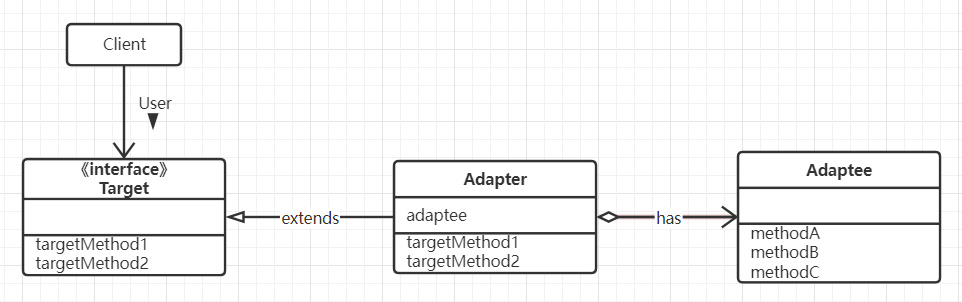

## 第一部分 适应设计模式
### Iterator模式
### Adapter模式、
    类型：
    继承模式

    委托模式

   
     登场角色：
        Target（对象）
        Client（请求者）
        Adaptee（被适配）
        Adapter（适配）
    什么时候使用Adapter模式
        
    相关的设计模式
        Bridge模式
        Decorator模式
## 第二部分 交给子类
### Template Method模式
    Tempate Method模式的类图

    
    登场角色：
        AbstractClass（抽象类）
        ConcreteClass（具体类）
    相关的设计模式
        Factory Method模式
        Strategy模式
    java源码使用场景：
        java.io.InputSteam
### Factory Method模式
    将实例的生成交给子类
