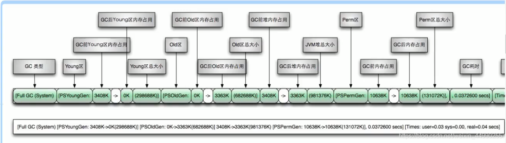
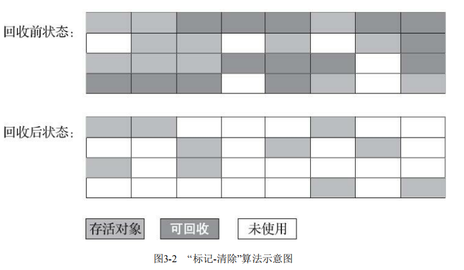
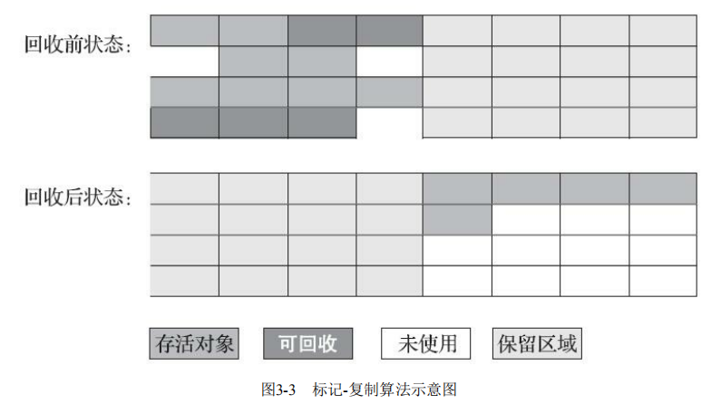
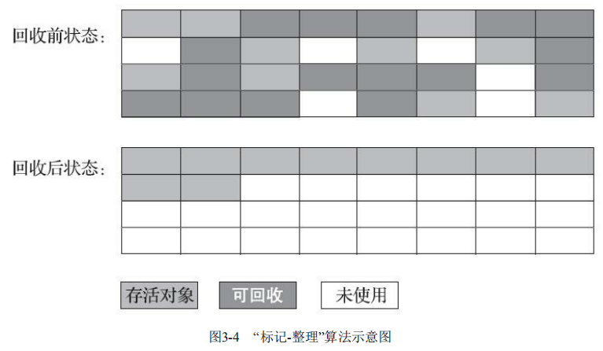
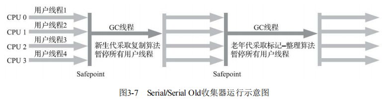
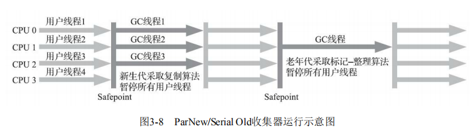
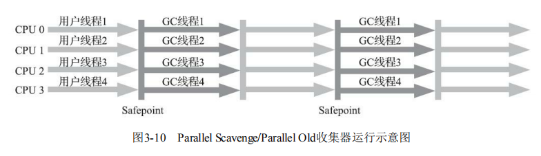
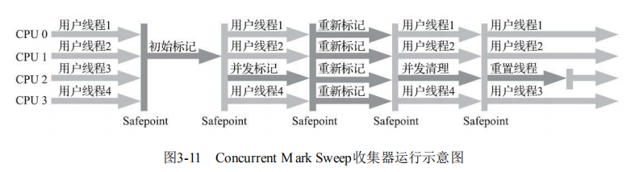
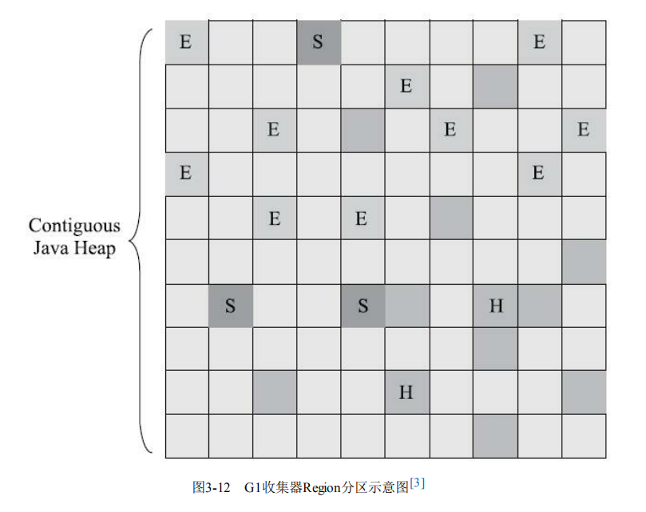
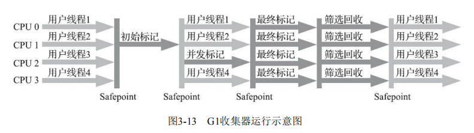

# 深入理解Java虚拟机：JVM高级特性与最佳实践（第3版）
## 第2章 Java内存区域与内存溢出异常 
### 2.2 运行时数据区域
    2.2.1 程序计数器
        程序计数器（Program Counter Register）是一块较小的内存空间，它可以看作是当前线程所执行的字节码的行号指示器。
        如果线程正在执行的是一个Java方法，这个计数器记录的是正在执行的虚拟机字节码指令的地址；如果正在执行的是本地（Native）方法，这个计数器值则应为空（Undefined）。
        此内存区域是唯 一一个在《Java虚拟机规范》中没有规定任何OutOfMemoryError情况的区域。
    2.2.2 Java虚拟机栈
        与程序计数器一样，Java虚拟机栈（Java Virtual Machine Stack）也是线程私有的，它的生命周期与线程相同。
        虚拟机栈描述的是Java方法执行的线程内存模型：每个方法被执行的时候，Java虚拟机都会同步创建一个栈帧[1]（Stack Frame）用于存储局部变量表、操作数栈、动态连接、方法出口等信息。每一个方法被调用直至执行完毕的过程，就对应着一个栈帧在虚拟机栈中从入栈到出栈的过程。
        局部变量表存放了编译期可知的各种Java虚拟机基本数据类型（boolean、byte、char、short、int、float、long、double）、对象引用（reference类型，它并不等同于对象本身，可能是一个指向对象起始地址的引用指针，也可能是指向一个代表对象的句柄或者其他与此对象相关的位置）和returnAddress类型（指向了一条字节码指令的地址）。
        这些数据类型在局部变量表中的存储空间以局部变量槽（Slot）来表示，其中64位长度的long和double类型的数据会占用两个变量槽，其余的数据类型只占用一个。
        局部变量表所需的内存空间在编译期间完成分配，当进入一个方法时，这个方法需要在栈帧中分配多大的局部变量空间是完全确定的，在方法运行期间不会改变局部变量表的大小。(这里说的“大小”是指变量槽的数量)
        域规定了两类异常状况：
            如果线程请求的栈深度大于虚拟机所允许的深度，将抛出StackOverflowError异常；
            如果Java虚拟机栈容量可以动态扩展(HotSpot虚拟机的栈容量是不可以动态扩展的)，当栈扩展时无法申请到足够的内存会抛出OutOfMemoryError异常。
    2.2.3 本地方法栈
        本地方法栈（Native Method Stacks）与虚拟机栈所发挥的作用是非常相似的，其区别只是虚拟机栈为虚拟机执行Java方法（也就是字节码）服务，而本地方法栈则是为虚拟机使用到的本地（Native）方法服务。
    2.2.4 Java堆
        逃逸分析：
        对于Java应用程序来说，Java堆（Java Heap）是虚拟机所管理的内存中最大的一块。有线程共享。在虚拟机启动时创建。唯一目的就是存放对象实例
        Java堆是垃圾收集器管理的内存区域，因此一些资料中它也被称作“GC堆”（Garbage Collected Heap，幸好国内没翻译成“垃圾堆”）。
        Java堆既可以被实现成固定大小的，也可以是可扩展的，不过当前主流的Java虚拟机都是按照可扩展来实现的（通过参数-Xmx和-Xms设定）。如果在Java堆中没有内存完成实例分配，并且堆也无法再扩展时，Java虚拟机将会抛出OutOfMemoryError异常。
    2.2.5 方法区
        程共享的内存区域，它用于存储已被虚拟机加载 的类型信息、常量、静态变量、即时编译器编译后的代码缓存等数据。它却有一个别名叫作“非堆”（Non-Heap），目的是与Java堆区 分开来。
    2.2.6 运行时常量池
        运行时常量池（Runtime Constant Pool）是方法区的一部分。Class文件中除了有类的版本、字 段、方法、接口等描述信息外，还有一项信息是常量池表（Constant Pool Table），用于存放编译期生成的各种字面量与符号引用，这部分内容将在类加载后存放到方法区的运行时常量池中。
        常量池无法再申请到内存 时会抛出OutOfMemoryError异常。
    2.2.7 直接内存
        直接内存（Direct Memory）并不是虚拟机运行时数据区的一部分，也不是《Java虚拟机规范》中定义的内存区域。
        但是这部分内存也被频繁地使用，而且也可能导致OutOfMemoryError异常出现，所以我们放到这里一起讲解。
### 2.3 HotSpot虚拟机对象探秘
    2.3.1 对象的创建
        内存的分配方式：
            “指针碰撞”（Bump The Pointer）：假设Java堆中内存是绝对规整的，所有被使用过的内存都被放在一边，空闲的内存被放在另一边，中间放着一个指针作为分界点的指示器，那所分配内存就仅仅是把那个指针向空闲空间方向挪动一段与对象大小相等的距离
            “空闲列表”（Free List）：但如果Java堆中的内存并不是规整的，已被使用的内存和空闲的内存相互交错在一起，那就没有办法简单地进行指针碰撞了，虚拟机就必须维护一个列表，记录上哪些内存块是可用的，在分配的时候从列表中找到一块足够大的空间划分给对象实例，并更新列表上的记录
        选择哪种分配方式由Java堆是否规整决定，而Java堆是否规整又由所采用的垃圾收集器是否带有空间压缩整理（Compact）的能力决定。        
        当使用Serial、ParNew等带压缩整理过程的收集器时，系统采用的分配算法是指针碰撞，既简单又高效；而当使用CMS这种基于清除（Sweep）算法的收集器时，理论上[1]就只能采用较为复杂的空闲列表来分配内存。
    2.4.2 虚拟机栈和本地方法栈溢出    
    2.4.3 方法区和运行时常量池溢出
        参数PermSize和MaxPermSize已经被移除和忽略。如果在命令行中使用，将会显示相应的警告。
    2.4.4 本机直接内存溢出
        直接内存（Direct Memory）的容量大小可通过-XX：MaxDirectMemorySize参数来指定，如果不去指定，则默认与Java堆最大值（由-Xmx指定）一致
## 第3章 垃圾收集器与内存分配策略 
    而Java堆和方法区这两个区域则有着很显著的不确定性：
        一个接口的多个实现类需要的内存可能会不一样，
        一个方法所执行的不同条件分支所需要的内存也可能不一样
    只有处于运行期间，我们才能知道程序究竟会创建哪些对象，创建多少个对象，这部分内存的分配和回收是动态的。垃圾收集器所关注的正是这部分内存该如何管理
### 3.2 对象已死？
    3.2.1 引用计数算法
        很多教科书判断对象是否存活的算法是这样的：在对象中添加一个引用计数器，每当有一个地方引用它时，计数器值就加一；当引用失效时，计数器值就减一；任何时刻计数器为零的对象就是不可能再被使用的。
        客观地说，引用计数算法（Reference Counting）虽然占用了一些额外的内存空间来进行计数，但它的原理简单，判定效率也很高，在大多数情况下它都是一个不错的算法。
        在Java领域，至少主流的Java虚拟机里面都没有选用引用计数算法来管理内存，主要原因是，这个看似简单的算法有很多例外情况要考虑，必须要配合大量额外处理才能保证正确地工作，譬如单纯的引用计数就很难解决对象之间相互循环引用的问题。

    3.2.2 可达性分析算法
        当前主流的商用程序语言（Java、C#，上溯至前面提到的古老的Lisp）的内存管理子系统，都是通过可达性分析（Reachability Analysis）算法来判定对象是否存活的。
        这个算法的基本思路就是通过一系列称为“GC Roots”的根对象作为起始节点集，从这些节点开始，根据引用关系向下搜索，搜索过程所走过的路径称为“引用链”（Reference Chain），如果某个对象到GC Roots间没有任何引用链相连，或者用图论的话来说就是从GC Roots到这个对象不可达时，则证明此对象是不可能再被使用的。
        在Java技术体系里面，固定可作为GC Roots的对象包括以下几种： 
            在虚拟机栈（栈帧中的本地变量表）中引用的对象，譬如各个线程被调用的方法堆栈中使用到的 参数、局部变量、临时变量等。 
            在方法区中类静态属性引用的对象，譬如Java类的引用类型静态变量。 
            在方法区中常量引用的对象，譬如字符串常量池（String Table）里的引用。
            在本地方法栈中JNI（即通常所说的Native方法）引用的对象。 
            Java虚拟机内部的引用，如基本数据类型对应的Class对象，一些常驻的异常对象（比如 NullPointExcepiton、OutOfMemoryError）等，还有系统类加载器。 
            所有被同步锁（synchronized关键字）持有的对象。 
            反映Java虚拟机内部情况的JMXBean、JVMTI中注册的回调、本地代码缓存等
            除了这些固定的GC Roots集合以外，根据用户所选用的垃圾收集器以及当前回收的内存区域不 同，还可以有其他对象“临时性”地加入，共同构成完整GC Roots集合。譬如后文将会提到的分代收集和局部回收（Partial GC），
    3.2.3 再谈引用
        无论是通过引用计数算法判断对象的引用数量，还是通过可达性分析算法判断对象是否引用链可达，判定对象是否存活都和“引用”离不开关系。
        在JDK 1.2版之后，Java对引用的概念进行了扩充，将引用分为强引用（Strongly Re-ference）、软引用（Soft Reference）、弱引用（Weak Reference）和虚引用（Phantom Reference）4种，这4种引用强度依次逐渐减弱。 
            ·强引用是最传统的“引用”的定义，是指在程序代码之中普遍存在的引用赋值，即类似“Object obj=new Object()”这种引用关系。无论任何情况下，只要强引用关系还存在，垃圾收集器就永远不会回 收掉被引用的对象。 
            ·软引用是用来描述一些还有用，但非必须的对象。只被软引用关联着的对象，在系统将要发生内存溢出异常前，会把这些对象列进回收范围之中进行第二次回收，如果这次回收还没有足够的内存，才会抛出内存溢出异常。在JDK 1.2版之后提供了SoftReference类来实现软引用。 
            ·弱引用也是用来描述那些非必须对象，但是它的强度比软引用更弱一些，被弱引用关联的对象只能生存到下一次垃圾收集发生为止。当垃圾收集器开始工作，无论当前内存是否足够，都会回收掉只 被弱引用关联的对象。在JDK 1.2版之后提供了WeakReference类来实现弱引用。 
            ·虚引用也称为“幽灵引用”或者“幻影引用”，它是最弱的一种引用关系。一个对象是否有虚引用的存在，完全不会对其生存时间构成影响，也无法通过虚引用来取得一个对象实例。为一个对象设置虚引用关联的唯一目的只是为了能在这个对象被收集器回收时收到一个系统通知。在JDK 1.2版之后提供 了PhantomReference类来实现虚引用
    3.2.4 生存还是死亡？
        1.如果这个对象被判定为确有必要执行finalize()方法，那么该对象将会被放置在一个名为F-Queue的队列之中，并在稍后由一条由虚拟机自动建立的、低调度优先级的Finalizer线程去执行它们的finalize() 方法。这里所说的“执行”是指虚拟机会触发这个方法开始运行，但并不承诺一定会等待它运行结束。这样做的原因是，如果某个对象的finalize()方法执行缓慢，或者更极端地发生了死循环，将很可能导致F-Queue队列中的其他对象永久处于等待，甚至导致整个内存回收子系统的崩溃。
        2.finalize()方法是对象逃脱死亡命运的最后一次机会，稍后收集器将对F-Queue中的对象进行第二次小规模的标记，如果对象要在finalize()中成功拯救自己——只要重新与引用链上的任何一个对象建立关联即可，譬如把自己 （this关键字）赋值给某个类变量或者对象的成员变量，那在第二次标记时它将被移出“即将回收”的集 合；如果对象这时候还没有逃脱，那基本上它就真的要被回收了。
    3.2.5 回收方法区
        方法区垃圾收集的“性价比”通常也是比较低的：在Java堆中，尤其是在新生代中，对常规应用进行一次垃圾收集通常可以回收70%至99%的内存空间，相比之下，方法区回收囿于苛刻的判定条件，其区域垃圾收集的回收成果往往远低于此。
        方法区的垃圾收集主要回收两部分内容：废弃的常量和不再使用的类型。
        判定一个常量是否“废弃”还是相对简单
            已经没有任何字符串对象引用常量池中的“java”常量，且虚拟机中也没有其他地方引用这个字面量。如果在这时发生内存回收，而且垃圾收集器判断确有必要的话，这个“java”常量就将会被系统清理出常量池。
            常量池中其他类（接 口）、方法、字段的符号引用也与此类似。
        而要判定一个类型是否属于“不再被使用的类”的条件就比较苛刻了。需要同时满足下面三个条件： 
            该类所有的实例都已经被回收，也就是Java堆中不存在该类及其任何派生子类的实例。 
            加载该类的类加载器已经被回收，这个条件除非是经过精心设计的可替换类加载器的场景，如 OSGi、JSP的重加载等，否则通常是很难达成的。 
            该类对应的java.lang.Class对象没有在任何地方被引用，无法在任何地方通过反射访问该类的方法。
        在大量使用反射、动态代理、CGLib等字节码框架，动态生成JSP以及OSGi这类频繁自定义类加载 器的场景中，通常都需要Java虚拟机具备类型卸载的能力，以保证不会对方法区造成过大的内存压力。
### 3.3 垃圾收集算法
    从如何判定对象消亡的角度出发，垃圾收集算法可以划分为“引用计数式垃圾收集”（Reference Counting GC）和“追踪式垃圾收集”（Tracing GC）两大类，这两类也常被称作“直接垃圾收集”和“间接垃圾收集”。
    3.3.1 分代收集理论
        它建立在两个分代假说之上： 
            1）弱分代假说（Weak Generational Hypothesis）：绝大多数对象都是朝生夕灭的。 
            2）强分代假说（Strong Generational Hypothesis）：熬过越多次垃圾收集过程的对象就越难以消亡。 
            3）跨代引用假说（Intergenerational Reference Hypothesis）：跨代引用相对于同代引用来说仅占极少数。
        在Java堆划分出不同的区域之后，垃圾收集器才可以每次只回收其中某一个或者某些部分的区域 ——因而才有了“Minor GC”“Major GC”“Full GC”这样的回收类型的划分；也才能够针对不同的区域安排与里面存储对象存亡特征相匹配的垃圾收集算法——因而发展出了“标记-复制算法”“标记-清除算 法”“标记-整理算法”等针对性的垃圾收集算法。
        把分代收集理论具体放到现在的商用Java虚拟机里，设计者一般至少会把Java堆划分为新生代 （Young Generation）和老年代（Old Generation）两个区域。顾名思义，在新生代中，每次垃圾收集时都发现有大批对象死去，而每次回收后存活的少量对象，将会逐步晋升到老年代中存放。
        部分收集（Partial GC）：指目标不是完整收集整个Java堆的垃圾收集，其中又分为： 
            新生代收集（Minor GC/Young GC）：指目标只是新生代的垃圾收集。 
            老年代收集（Major GC/Old GC）：指目标只是老年代的垃圾收集。目前只有CMS收集器会有单独收集老年代的行为。另外请注意“Major GC”这个说法现在有点混淆，在不同资料上常有不同所指，读者需按上下文区分到底是指老年代的收集还是整堆收集。 
            混合收集（Mixed GC）：指目标是收集整个新生代以及部分老年代的垃圾收集。目前只有G1收 集器会有这种行为。 
        整堆收集（Full GC）：收集整个Java堆和方法区的垃圾收集。
    3.3.2 标记-清除算法
        最早出现也是最基础的垃圾收集算法是“标记-清除”（Mark-Sweep）算法，在1960年由Lisp之父 John McCarthy所提出。
        首先标记出所有需要回收的对象，在标记完成后，统一回收掉所有被标记的对象，也可以反过来，标记存活的对象，统一回收所有未被标记的对象。
        主要缺点有两个：
            第一个是执行效率不稳定，如果Java堆中包含大量对象，而且其中大部分是需要被回收的，这时必须进行大量标记和清除的动作，导致标记和清除两个过 程的执行效率都随对象数量增长而降低；
            第二个是内存空间的碎片化问题，标记、清除之后会产生大量不连续的内存碎片，空间碎片太多可能会导致当以后在程序运行过程中需要分配较大对象时无法找 到足够的连续内存而不得不提前触发另一次垃圾收集动作。

    3.3.3 标记-复制算法
        1969年Fenichel提出了一种称为“半区复制”（Semispace Copying）的垃圾收集算法。
        它将可用内存按容量划分为大小相等的两块，每次只使用其中的一块。当这一块的内存用完了，就将还存活着的对象复制到另外一块上面，然后再把已使用过的内存空间一次清理掉。
        在1989年，Andrew Appel针对具备“朝生夕灭”特点的对象，提出了一种更优化的半区复制分代策 略，现在称为“Appel式回收”。
        HotSpot虚拟机的Serial、ParNew等新生代收集器均采用了这种策略来设 计新生代的内存布局[1]。
        Appel式回收的具体做法：
            把新生代分为一块较大的Eden空间和两块较小的Survivor空间，每次分配内存只使用Eden和其中一块Survivor。发生垃圾搜集时，将Eden和Survivor中仍然存活的对象一次性复制到另外一块Survivor空间上，然后直接清理掉Eden和已用过的那块Survivor空间。
            HotSpot虚拟机默认Eden和Survivor的大小比例是8∶1，也即每次新生代中可用内存空间为整个新生代容量的90%（Eden的80%加上一个Survivor的10%），只有一个Survivor空间，即10%的新生代是会 被“浪费”的。
            当然，98%的对象可被回收仅仅是“普通场景”下测得的数据，任何人都没有办法百分百保证每次回收都只有不多于10%的对象存活，因此Appel式回收还有一个充当罕见情况的“逃生门”的安全设计，当Survivor空间不足以容纳一次Minor GC之后存活的对象时，就需要依赖其他内存区域（实 际上大多就是老年代）进行分配担保（Handle Promotion）

    3.3.4 标记-整理算法
        针对老年代对象的存亡特征，1974年Edward Lueders提出了另外一种有针对性的“标记-整 理”（Mark-Compact）算法，其中的标记过程仍然与“标记-清除”算法一样，但后续步骤不是直接对可回收对象进行清理，而是让所有存活的对象都向内存空间一端移动，然后直接清理掉边界以外的内存。
        而且这种对象移动操作必须全程暂停用户应用程序才能进行。
        但如果跟标记-清除算法那样完全不考虑移动和整理存活对象的话，弥散于堆中的存活对象导致的空间碎片化问题就只能依赖更为复杂的内存分配器和内存访问器来解决。
        譬如通过“分区空闲分配链 表”来解决内存分配问题（计算机硬盘存储大文件就不要求物理连续的磁盘空间，能够在碎片化的硬盘上存储和访问就是通过硬盘分区表实现的）。
        内存的访问是用户程序最频繁的操作，甚至都没有之一，假如在这个环节上增加了额外的负担，势必会直接影响应用程序的吞吐量。
        HotSpot虚拟机里面关注吞吐量的Parallel Scavenge收集器是基于标记-整理算法的，而关注延迟的CMS收集器则是基于标记-清除算法的，这也从侧面印证这点。

      
### 3.4 HotSpot的算法细节实现
    3.4.1 根节点枚举
        
    3.4.2 安全点
    3.4.3 安全区域
    3.4.4 记忆集与卡表
    3.4.5 写屏障
    3.4.6 并发的可达性分析
### 3.5 经典垃圾收集器
    3.5.1 Serial收集器
        依然是HotSpot虚拟机运行在客户端模式下的默认新生代收集器
        Serial收集器是最基础、历史最悠久的收集器，曾经（在JDK 1.3.1之前）是HotSpot虚拟机新生代收集器的唯一选择。
        是一个单线程工作的收集器，但它的“单线 程”的意义并不仅仅是说明它只会使用一个处理器或一条收集线程去完成垃圾收集工作，更重要的是强调在它进行垃圾收集时，必须暂停其他所有工作线程，直到它收集结束。
        从Serial收集器到Parallel收集器，再到Concurrent Mark Sweep（CMS）和Garbage First（G1）收集器，最终至现在垃圾收集器的最前沿成果Shenandoah和ZGC 等，我们看到了一个个越来越构思精巧，越来越优秀，也越来越复杂的垃圾收集器不断涌现，用户线 程的停顿时间在持续缩短，但是仍然没有办法彻底消除（这里不去讨论RTSJ中的收集器），探索更优 秀垃圾收集器的工作仍在继续。

        
        有着优于其他收集器的地方，那就是简单而高效（与其他收集器的单线程相比），对于内存资源受限的环境，它是所有收集器里额外内存消耗（Memory Footprint）[1]最小的；对于单核处理器或处理器核心数较少的环境来说，Serial收集器由于没有线程交互的开销，专心做垃圾收集自然可以 获得最高的单线程收集效率。
    3.5.2 ParNew收集器（新生代收集器，并行）
        ParNew收集器实质上是Serial收集器的多线程并行版本，除了同时使用多条线程进行垃圾收集之外，其余的行为包括Serial收集器可用的所有控制参数（例如：-XX：SurvivorRatio、-XX： PretenureSizeThreshold、-XX：HandlePromotionFailure等）、收集算法、Stop The World、对象分配规 则、回收策略等都与Serial收集器完全一致，在实现上这两种收集器也共用了相当多的代码。

        
        在JDK 5发布时，HotSpot推出了一款在强交互应用中几乎可称为具有划时代意义的垃圾收集器——CMS收集器。这款收集器是HotSpot虚拟机中第一款真正意义上支持并发的垃圾收集器，它首次实现了让垃圾收集线程与用户线程（基本上）同时工作。
        CMS作为老年代的收集器，却无法与JDK 1.4.0中已经存在的新生代收集器Parallel Scavenge配合工作[1]，所以在JDK 5中使用CMS来收集老年代的时候，新生代只能选择ParNew或者 Serial收集器中的一个。ParNew收集器是激活CMS后（使用-XX：+UseConcMarkSweepGC选项）的默 认新生代收集器，也可以使用-XX：+/-UseParNewGC选项来强制指定或者禁用它。    
        G1是一个面向全堆的收集器，不再需要其他新生代收集器的配合工作。
        ParNew可以说是HotSpot虚拟机中第一款退出历史舞台的垃圾收集器。
    3.5.3 Parallel Scavenge收集器（新生代收集器，并行）
        Parallel Scavenge收集器也是一款新生代收集器，它同样是基于标记-复制算法实现的收集器，也是能够并行收集的多线程收集器，也经常被称作“吞吐量优先收集器”。
        CMS等收集器的关注点是尽可能地缩短垃圾收集时用户线程的停顿时间，而Parallel Scavenge收集器的目标则是达到一个可控制的吞吐 量（Throughput）。所谓吞吐量就是处理器用于运行用户代码的时间与处理器总消耗时间的比值， 即：吞吐量 = 运行用户代码时间 / (运行用户代码时间 + 运行垃圾收集时间)。
        Parallel Scavenge收集器提供了两个参数用于精确控制吞吐量，分别是控制最大垃圾收集停顿时间 的-XX：MaxGCPauseMillis参数以及直接设置吞吐量大小的-XX：GCTimeRatio参数。
            -XX：MaxGCPauseMillis参数允许的值是一个大于0的毫秒数，收集器将尽力保证内存回收花费的时间不超过用户设定值。垃圾收集停顿时间缩短是以牺牲吞吐量和新生代空间为代价换取的。时间越小，新生代空间越小，gc次数就越多，这样停顿时间的确在下降，但吞吐量也降下来了。 
            -XX：GCTimeRatio参数的值则应当是一个大于0小于100的整数，也就是垃圾收集时间占总时间的 比率，相当于吞吐量的倒数。譬如把此参数设置为19，那允许的最大垃圾收集时间就占总时间的5% （即1/(1+19)），默认值为99，即允许最大1%（即1/(1+99)）的垃圾收集时间。
            -XX：+UseAdaptiveSizePolicy是一个开关参数，当这个参数被激活之后，就不需要人工指定新生代的大小（-Xmn）、Eden与Survivor区 的比例（-XX：SurvivorRatio）、晋升老年代对象大小（-XX：PretenureSizeThreshold）等细节参数了，虚拟机会根据当前系统的运行情况收集性能监控信息，动态调整这些参数以提供最合适的停顿时 间或者最大的吞吐量。这种调节方式称为垃圾收集的自适应的调节策略（GC Ergonomics）[1]。
                如果读者对于收集器运作不太了解，手工优化存在困难的话，使用Parallel Scavenge收集器配合自适应调节策 略，把内存管理的调优任务交给虚拟机去完成也许是一个很不错的选择。只需要把基本的内存数据设 置好（如-Xmx设置最大堆），然后使用-XX：MaxGCPauseMillis参数（更关注最大停顿时间）或- XX：GCTimeRatio（更关注吞吐量）参数给虚拟机设立一个优化目标，那具体细节参数的调节工作就 由虚拟机完成了。自适应调节策略也是Parallel Scavenge收集器区别于ParNew收集器的一个重要特性。
    3.5.4 Serial Old收集器（老年代版本，单线程，标记-整理算法）
        Serial Old是Serial收集器的老年代版本，它同样是一个单线程收集器，使用标记-整理算法。
        的主要意义也是供客户端模式下的HotSpot虚拟机使用。

    3.5.5 Parallel Old收集器（老年代，并发，标记-整理算法）
        Parallel Old是Parallel Scavenge收集器的老年代版本，支持多线程并发收集，基于标记-整理算法实 现。这个收集器是直到JDK 6时才开始提供的。
        在注重吞吐量或者处理器资源较为稀缺的场合，都可以优先考虑Parallel Scavenge加Parallel Old收集器这个组合。

    
    3.5.6 CMS收集器（并发，标记-清除算法）
        CMS（Concurrent Mark Sweep）收集器是一种以获取最短回收停顿时间为目标的收集器。
        整个过程分为四个步骤
            1）初始标记（CMS initial mark）
            2）并发标记（CMS concurrent mark）
            3）重新标记（CMS remark）
            4）并发清除（CMS concurrent sweep）

        
        其中初始标记、重新标记这两个步骤仍然需要“Stop The World”。
        初始标记仅仅只是标记一下GC Roots能直接关联到的对象，速度很快；
        并发标记阶段就是从GC Roots的直接关联对象开始遍历整个对象图的过程，这个过程耗时较长但是不需要停顿用户线程，可以与垃圾收集线程一起并发运行；
        而重新标记阶段则是为了修正并发标记期间，因用户程序继续运作而导致标记产生变动的那一部分对象的标记记录（详见3.4.6节中关于增量更新的讲解），这个阶段的停顿时间通常会比初始标记阶段稍长一些，但也远比并发标记阶段的时间短；
        最后是并发清除阶段，清理删除掉标记阶段判断的已经死亡的对象，由于不需要移动存活对象，所以这个阶段也是可以与用户线程同时并发的。
        下三个明显的缺点：
            首先，CMS收集器对处理器资源非常敏感。在并发阶段，它虽然不会导致用户线程停顿，但却会因为占用了一部分线程（或者说处理器的计 算能力）而导致应用程序变慢，降低总吞吐量。
                CMS默认启动的回收线程数是（处理器核心数量 +3）/4，也就是说，如果处理器核心数在四个或以上，并发回收时垃圾收集线程只占用不超过25%的处理器运算资源，并且会随着处理器核心数量的增加而下降。
                为了缓解这种情况，虚拟机提供了一种称为“增量式并发收集器”（Incremental Concurrent Mark Sweep/i-CMS）的CMS收集器变种
            然后，由于CMS收集器无法处理“浮动垃圾”（Floating Garbage），有可能出现“Con-current Mode Failure”失败进而导致另一次完全“Stop The World”的Full GC的产生。
                浮动垃圾：在CMS的并发标记和并发清理阶 段，用户线程是还在继续运行的，程序在运行自然就还会伴随有新的垃圾对象不断产生，但这一部分 垃圾对象是出现在标记过程结束以后，CMS无法在当次收集中处理掉它们，只好留待下一次垃圾收集时再清理掉。
                参数-XX：CMSInitiatingOccupancyFraction，设置太低，会内存回收频繁，设置得太高将会很容易导致大量的并发失败产生，性能反而降低，用户应在生产环境中根据实际应用情况来权衡设置。
            CMS是一款基于“标记-清除”算法实现的收集器，如果读者对前面这部分介绍还有印象的话，就可能想到这意味着收集结束时会有大量空间碎片产生。
                CMS收集器提供了一个-XX：+UseCMS-CompactAtFullCollection开关参数，用于在CMS收集器不得不进行Full GC时开启内存碎片的合并整理过程，由于这个内存整理必须移动存活对象，（在Shenandoah和ZGC出现前）是无法并发的。
                但停顿时间又会变长，因此虚拟机设计者们还提供了另外一个参数-XX：CMSFullGCsBefore- Compaction（此参数从JDK 9开始废弃），这个参数的作用是要求CMS收集器在执行过若干次（数量由参数值决定）不整理空间的Full GC之后，下一次进入Full GC前会先进行碎片整理（默认值为0，表示每次进入Full GC时都进行碎片整理）。
    3.5.7 Garbage First收集器
        Garbage First（简称G1）收集器是垃圾收集器技术发展历史上的里程碑式的成果，它开创了收集 器面向局部收集的设计思路和基于Region的内存布局形式。
        它可以面向堆内存任何部分来组成回收集（Collection Set，一般简称CSet）进行回收，衡量标准不再是它属于哪个分代，而是哪块内存中存放的垃圾数量最多，回收收益最大，这就是G1收集器的Mixed GC模式。
        G1不再坚持固定大小以及固定数量的分代区域划分，而是把连续的Java堆划分为多个大小相等的独立区域（Region），每一个Region都可以根据需要，扮演新生代的Eden空间、Survivor空间，或者老年代空间。
        Region中还有一类特殊的Humongous区域，专门用来存储大对象。G1认为只要大小超过了一个 Region容量一半的对象即可判定为大对象。每个Region的大小可以通过参数-XX：G1HeapRegionSize设 定，取值范围为1MB～32MB，且应为2的N次幂。

        些关键的细节问题需要妥善解决：
            将Java堆分成多个独立Region后，Region里面存在的跨Region引用对象如何解决？
            在并发标记阶段如何保证收集线程与用户线程互不干扰地运行？
            怎样建立起可靠的停顿预测模型？
        如果我们不去计算用户线程运行过程中的动作（如使用写屏障维护记忆集的操作），G1收集器的 运作过程大致可划分为以下四个步骤： 
            ·初始标记（Initial Marking）：仅仅只是标记一下GC Roots能直接关联到的对象，并且修改TAMS 指针的值，让下一阶段用户线程并发运行时，能正确地在可用的Region中分配新对象。这个阶段需要停顿线程，但耗时很短，而且是借用进行Minor GC的时候同步完成的，所以G1收集器在这个阶段实际并没有额外的停顿。 
            ·并发标记（Concurrent Marking）：从GC Root开始对堆中对象进行可达性分析，递归扫描整个堆 里的对象图，找出要回收的对象，这阶段耗时较长，但可与用户程序并发执行。当对象图扫描完成以后，还要重新处理SATB记录下的在并发时有引用变动的对象。 
            ·最终标记（Final Marking）：对用户线程做另一个短暂的暂停，用于处理并发阶段结束后仍遗留 下来的最后那少量的SATB记录。 
            ·筛选回收（Live Data Counting and Evacuation）：负责更新Region的统计数据，对各个Region的回 收价值和成本进行排序，根据用户所期望的停顿时间来制定回收计划，可以自由选择任意多个Region构成回收集，然后把决定回收的那一部分Region的存活对象复制到空的Region中，再清理掉整个旧Region的全部空间。这里的操作涉及存活对象的移动，是必须暂停用户线程，由多条收集器线程并行完成的。

### 3.6 低延迟垃圾收集器
    衡量垃圾收集器的三项最重要的指标是：内存占用（Footprint）、吞吐量（Throughput）和延迟 （Latency），三者共同构成了一个“不可能三角[1]”。
    3.6.1 Shenandoah收集器
    3.6.2 ZGC收集器
### 3.7 选择合适的垃圾收集器
    3.7.1 Epsilon收集器
    3.7.2 收集器的权衡
    
## 第4章 虚拟机性能监控、故障处理工具 

## 第5章 调优案例分析与实战
