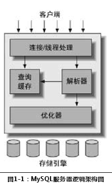
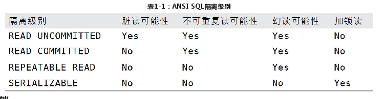

# 高性能MySQL(第三版)
## 第1章　MySQL架构与历史
### 1.1　MySQL逻辑架构

    最上层的服务并不是MySQL所独有的，大多数基于网络的客户端/服务器的工具或者服务都有类似的架构。比如连接处理、授权认证、安全等等。
    第二层架构是MySQL比较有意思的部分。大多数MySQL的核心服务功能都在这一层，包括查询解析、分析、优化、缓存以及所有的内置函数（例如，日期、时间、数学和加密函数），所有跨存储引擎的功能都在这一层实现：存储过程、触发器、视图等。
    第三层包含了存储引擎。存储引擎负责MySQL中数据的存储和提取。和GNU/Linux下的各种文件系统一样，每个存储引擎都有它的优势和劣势。服务器通过API与存储引擎进行通信。这些接口屏蔽了不同存储引擎之间的差异，使得这些差异对上层的查询过程透明。存储引擎API包含几十个底层函数，用于执行诸如“开始一个事务”或者“根据主键提取一行记录”等操作。但存储引擎不会去解析SQL(1)，不同存储引擎之间也不会相互通信，而只是简单地响应上层服务器的请求。
### 1.2 并发控制
    读写锁
        在处理并发读或者写时，可以通过实现一个由两种类型的锁组成的锁系统来解决问题。这两种类型的锁通常被称为共享锁（shared lock）和排他锁（exclusive lock），也叫读锁（read lock）和写锁（write lock）。
        ：读锁是共享的，或者说是相互不阻塞的。多个客户在同一时刻可以同时读取同一个资源，而互不干扰。写锁则是排他的，也就是说一个写锁会阻塞其他的写锁和读锁，这是出于安全策略的考虑，只有这样，才能确保在给定的时间里，只有一个用户能执行写入，并防止其他用户读取正在写入的同一资源。
    锁粒度
        所谓的锁策略，就是在锁的开销和数据的安全性之间寻求平衡，这种平衡当然也会影响到性能。大多数商业数据库系统没有提供更多的选择，一般都是在表上施加行级锁（row-level lock），并以各种复杂的方式来实现，以便在锁比较多的情况下尽可能地提供更好的性能。
        两种最重要的锁策略：
            表锁：
                表锁是MySQL中最基本的锁策略，并且是开销最小的策略。表锁非常类似于前文描述的邮箱加锁机制：它会锁定整张表。一个用户在对表进行写操作（插入、删除、更新等）前，需要先获得写锁，这会阻塞其他用户对该表的所有读写操作。只有没有写锁时，其他读取的用户才能获得读锁，读锁之间是不相互阻塞的。
                尽管存储引擎可以管理自己的锁，MySQL本身还是会使用各种有效的表锁来实现不同的目的。例如，服务器会为诸如ALTER TABLE之类的语句使用表锁，而忽略存储引擎的锁机制。
            行级锁（row lock）
                行级锁可以最大程度地支持并发处理（同时也带来了最大的锁开销）。众所周知，在InnoDB和XtraDB，以及其他一些存储引擎中实现了行级锁。
                行级锁只在存储引擎层实现，而MySQL服务器层（如有必要，请回顾前文的逻辑架构图）没有实现。服务器层完全不了解存储引擎中的锁实现。
### 1.3 事务
    事务内的语句，要么全部执行成功，要么全部执行失败。
    ACID表示原子性（atomicity）、一致性（consistency）、隔离性（isolation）和持久性（durability）。
        原子性（atomicity）
            一个事务必须被视为一个不可分割的最小工作单元，整个事务中的所有操作要么全部提交成功，要么全部失败回滚，对于一个事务来说，不可能只执行其中的一部分操作，这就是事务的原子性。
        一致性（consistency）
            数据库总是从一个一致性的状态转换到另外一个一致性的状态。在前面的例子中，一致性确保了，即使在执行第三、四条语句之间时系统崩溃，支票账户中也不会损失200美元，因为事务最终没有提交，所以事务中所做的修改也不会保存到数据库中。
        隔离性（isolation）
            通常来说，一个事务所做的修改在最终提交以前，对其他事务是不可见的。在前面的例子中，当执行完第三条语句、第四条语句还未开始时，此时有另外一个账户汇总程序开始运行，则其看到的支票账户的余额并没有被减去200美元。后面我们讨论隔离级别（Isolation level）的时候，会发现为什么我们要说“通常来说”是不可见的。
        持久性（durability）
            一旦事务提交，则其所做的修改就会永久保存到数据库中。此时即使系统崩溃，修改的数据也不会丢失。持久性是个有点模糊的概念，因为实际上持久性也分很多不同的级别。有些持久性策略能够提供非常强的安全保障，而有些则未必。而且不可能有能做到100％的持久性保证的策略（如果数据库本身就能做到真正的持久性，那么备份又怎么能增加持久性呢？）。在后面的一些章节中，我们会继续讨论MySQL中持久性的真正含义。
    对于一些不需要事务的查询类应用，选择一个非事务型的存储引擎，可以获得更高的性能。即使存储引擎不支持事务，也可以通过LOCK TABLES语句为应用提供一定程度的保护，这些选择用户都可以自主决定。
#### 1.3.1　隔离级别
    较低级别的隔离通常可以执行更高的并发，系统的开销也更低。
    四种隔离级别：
        READ UNCOMMITTED（未提交读）
            在READ UNCOMMITTED级别，事务中的修改，即使没有提交，对其他事务也都是可见的。事务可以读取未提交的数据，这也被称为脏读（Dirty Read）。这个级别会导致很多问题，从性能上来说，READ UNCOMMITTED不会比其他的级别好太多，但却缺乏其他级别的很多好处，除非真的有非常必要的理由，在实际应用中一般很少使用。
        READ COMMITTED（提交读）
            大多数数据库系统的默认隔离级别都是READ COMMITTED（但MySQL不是）。READ COMMITTED满足前面提到的隔离性的简单定义：一个事务开始时，只能“看见”已经提交的事务所做的修改。换句话说，一个事务从开始直到提交之前，所做的任何修改对其他事务都是不可见的。这个级别有时候也叫做不可重复读（nonrepeatable read），因为两次执行同样的查询，可能会得到不一样的结果。
        REPEATABLE READ（可重复读）REPEATABLE READ解决了脏读的问题。该级别保证了在同一个事务中多次读取同样记录的结果是一致的。但是理论上，可重复读隔离级别还是无法解决另外一个幻读（Phantom Read）的问题。所谓幻读，指的是当某个事务在读取某个范围内的记录时，另外一个事务又在该范围内插入了新的记录，当之前的事务再次读取该范围的记录时，会产生幻行（Phantom Row）。InnoDB和XtraDB存储引擎通过多版本并发控制（MVCC，Multiversion Concurrency Control）解决了幻读的问题。本章稍后会做进一步的讨论。
            可重复读是MySQL的默认事务隔离级别。
        SERIALIZABLE（可串行化）
            SERIALIZABLE是最高的隔离级别。它通过强制事务串行执行，避免了前面说的幻读的问题。简单来说，SERIALIZABLE会在读取的每一行数据上都加锁，所以可能导致大量的超时和锁争用的问题。实际应用中也很少用到这个隔离级别，只有在非常需要确保数据的一致性而且可以接受没有并发的情况下，才考虑采用该级别。    

#### 1.3.2　死锁
    死锁是指两个或者多个事务在同一资源上相互占用，并请求锁定对方占用的资源，从而导致恶性循环的现象。当多个事务试图以不同的顺序锁定资源时，就可能会产生死锁。多个事务同时锁定同一个资源时，也会产生死锁。
    InnoDB目前处理死锁的方法是，将持有最少行级排他锁的事务进行回滚（这是相对比较简单的死锁回滚算法）。
#### 1.3.3　事务日志
    事务日志可以帮助提高事务的效率。
    事务日志采用的是追加的方式，因此写日志的操作是磁盘上一小块区域内的顺序I/O，而不像随机I/O需要在磁盘的多个地方移动磁头，所以采用事务日志的方式相对来说要快得多。
#### 1.3.4　MySQL中的事务
    MySQL提供了两种事务型的存储引擎：InnoDB和NDB Cluster。另外还有一些第三方存储引擎也支持事务，比较知名的包括XtraDB和PBXT。后
    自动提交（AUTOCOMMIT）
        MySQL默认采用自动提交（AUTOCOMMIT）模式。也就是说，如果不是显式地开始一个事务，则每个查询都被当作一个事务执行提交操作。在当前连接中，可以通过设置AUTOCOMMIT变量来启用或者禁用自动提交模式：
        MySQL可以通过执行SET TRANSACTION ISOLATION LEVEL命令来设置隔离级别。新的隔离级别会在下一个事务开始的时候生效。可以在配置文件中设置整个数据库的隔离级别，也可以只改变当前会话的隔离级别：
        mysql> SET SESSION TRANSACTION ISOLATION LEVEL READ COMMITTED;
        MySQL能够识别所有的4个ANSI隔离级别，InnoDB引擎也支持所    
    在事务中混合使用存储引擎
        如果在事务中混合使用了事务型和非事务型的表（例如InnoDB和MyISAM表），在正常提交的情况下不会有什么问题。
        但如果该事务需要回滚，非事务型的表上的变更就无法撤销，这会导致数据库处于不一致的状态，这种情况很难修复，事务的最终结果将无法确定。所以，为每张表选择合适的存储引擎非常重要。
    隐式和显式锁定
        InnoDB采用的是两阶段锁定协议（two-phase locking protocol）。在事务执行过程中，随时都可以执行锁定，锁只有在执行COMMIT或者ROLLBACK的时候才会释放，并且所有的锁是在同一时刻被释放。前面描述的锁定都是隐式锁定，InnoDB会根据隔离级别在需要的时候自动加锁。
        另外，InnoDB也支持通过特定的语句进行显式锁定，这些语句不属于SQL规范(3)：
            SELECT ... LOCK IN SHARE MODE
            SELECT ... FOR UPDATE
        MySQL也支持LOCK TABLES和UNLOCK TABLES语句，这是在服务器层实现的，和存储引擎无关。它们有自己的用途，但并不能替代事务处理。如果应用需要用到事务，还是应该选择事务型存储引擎。
        经常可以发现，应用已经将表从MyISAM转换到InnoDB，但还是显式地使用LOCK TABLES语句。这不但没有必要，还会严重影响性能，实际上InnoDB的行级锁工作得更好。
### 1.4　多版本并发控制
    MVCC是行级锁的一个变种，但是它在很多情况下避免了加锁操作，因此开销更低。虽然实现机制有所不同，但大都实现了非阻塞的读操作，写操作也只锁定必要的行。
    MVCC的实现，是通过保存数据在某个时间点的快照来实现的。
    InnoDB的MVCC，是通过在每行记录后面保存两个隐藏的列来实现的。这两个列，一个保存了行的创建时间，一个保存行的过期时间（或删除时间）。当然存储的并不是实际的时间值，而是系统版本号（system version number）。每开始一个新的事务，系统版本号都会自动递增。事务开始时刻的系统版本号会作为事务的版本号，用来和查询到的每行记录的版本号进行比较。下面看一下在REPEATABLE READ隔离级别下，MVCC具体是如何操作的。
    SELECT
        InnoDB会根据以下两个条件检查每行记录：
        InnoDB只查找版本早于当前事务版本的数据行（也就是，行的系统版本号小于或等于事务的系统版本号），这样可以确保事务读取的行，要么是在事务开始前已经存在的，要么是事务自身插入或者修改过的。
        行的删除版本要么未定义，要么大于当前事务版本号。这可以确保事务读取到的行，在事务开始之前未被删除。
        只有符合上述两个条件的记录，才能返回作为查询结果。
    INSERT
        InnoDB为新插入的每一行保存当前系统版本号作为行版本号。
    DELETE
        InnoDB为删除的每一行保存当前系统版本号作为行删除标识。
    UPDATE
        InnoDB为插入一行新记录，保存当前系统版本号作为行版本号，同时保存当前系统版本号到原来的行作为行删除标识。
    保存这两个额外系统版本号，使大多数读操作都可以不用加锁。这样设计使得读数据操作很简单，性能很好，并且也能保证只会读取到符合标准的行。不足之处是每行记录都需要额外的存储空间，需要做更多的行检查工作，以及一些额外的维护工作。
    MVCC只在REPEATABLE READ和READ COMMITTED两个隔离级别下工作。其他两个隔离级别都和MVCC不兼容(4)，因为READ UNCOMMITTED总是读取最新的数据行，而不是符合当前事务版本的数据行。而SERIALIZABLE则会对所有读取的行都加锁。
### 1.5　MySQL的存储引擎
#### 1.5.1　InnoDB存储引擎
    InnoDB是MySQL的默认事务型引擎，也是最重要、使用最广泛的存储引擎。它被设计用来处理大量的短期（short-lived）事务，短期事务大部分情况是正常提交的，很少会被回滚。
    InnoDB的性能和自动崩溃恢复特性，使得它在非事务型存储的需求中也很流行。

# MySQL 是怎样运行的：从根儿上理解 MySQL
## 初识MySQL
    客户端与服务器连接的过程
        TCP/IP
        命名管道和共享内存
        Unix域套接字文件
    服务器处理客户端请求

        
        服务器程序处理来自客户端的查询请求大致需要经过三个部分，分别是连接管理、解析与优化、存储引擎。
            连接管理
                客户端进程可以采用我们上边介绍的TCP/IP、命名管道或共享内存、Unix域套接字这几种方式之一来与服务器进程建立连接
                在客户端程序发起连接的时候，需要携带主机信息、用户名、密码，服务器程序会对客户端程序提供的这些信息进行认证，如果认证失败，服务器程序会拒绝连接。
                另外，如果客户端程序和服务器程序不运行在一台计算机上，我们还可以采用使用了SSL（安全套接字）的网络连接进行通信，来保证数据传输的安全性。
                MySQL服务器接收到的请求只是一个文本消息，该文本消息还要经过各种处理
            解析与优化
                MySQL服务器已经获得了文本形式的请求，接着还要经过九九八十一难的处理，其中的几个比较重要的部分分别是查询缓存、语法解析和查询优化
                查询缓存
                    会把刚刚处理过的查询请求和结果缓存起来，如果下一次有一模一样的请求过来，直接从缓存中查找结果就好了
                    如果两个查询请求在任何字符上的不同（例如：空格、注释、大小写），都会导致缓存不会命中。
                    另外，如果查询请求中包含某些系统函数、用户自定义变量和函数、一些系统表，如 mysql 、information_schema、 performance_schema 数据库中的表，那这个请求就不会被缓存。
                    如对该表使用了INSERT、 UPDATE、DELETE、TRUNCATE TABLE、ALTER TABLE、DROP TABLE或 DROP DATABASE语句，那使用该表的所有高速缓存查询都将变为无效并从高速缓存中删除！
                    从MySQL 5.7.20开始，不推荐使用查询缓存，并在MySQL 8.0中删除。
                语法解析
                    如果查询缓存没有命中，接下来就需要进入正式的查询阶段了。
                    首先要对这段文本做分析，判断请求的语法是否正确，然后从文本中将要查询的表、各种查询条件都提取出来放到MySQL服务器内部使用的一些数据结构上来。
                查询优化
                    MySQL的优化程序会对我们的语句做一些优化，如外连接转换为内连接、表达式简化、子查询转为连接吧啦吧啦的一堆东西。
                    优化的结果就是生成一个执行计划，这个执行计划表明了应该使用哪些索引进行查询，表之间的连接顺序是啥样的。我们可以使用EXPLAIN语句来查看某个语句的执行计划，关于查询优化这部分的详细内容我们后边会仔细唠叨，现在你只需要知道在MySQL服务器程序处理请求的过程中有这么一个步骤就好了。
            存储引擎
                MySQL服务器把数据的存储和提取操作都封装到了一个叫存储引擎的模块里。
                为了管理方便，人们把连接管理、查询缓存、语法解析、查询优化这些并不涉及真实数据存储的功能划分为MySQL server的功能，把真实存取数据的功能划分为存储引擎的功能。
                各种不同的存储引擎向上边的MySQL server层提供统一的调用接口（也就是存储引擎API），包含了几十个底层函数，像"读取索引第一条内容"、"读取索引下一条内容"、"插入记录"等等。
            设置表的存储引擎
                CREATE TABLE 表名(
                    建表语句;
                ) ENGINE = 存储引擎名称;
            修改表的存储引擎
                ALTER TABLE 表名 ENGINE = 存储引擎名称;

